# LIGN Database Schema (v0.3)

This document is the relational specification for LIGN's PostgreSQL/Supabase database. It translates the approved `docs/DOMAIN_MODEL.md` into concrete tables, keys, constraints, and indexes, in coordination with `docs/PERMISSIONS.md`. **No SQL, migrations, RLS policies, or storage rules are implemented here** — this is a spec awaiting implementation.

### v0.3 — additions from permissions design
- **`activity_events.project_id UUID NULL`** added. Nullable, no FK (audit rows must survive subject deletion). Populated for project-scoped events; NULL for workspace-scoped administrative events. Enables efficient project-scoped audit RLS. See §3.25 and PERMISSIONS.md §15.1.
- **`workspace_members.user_id` immutability** elevated to a DB-boundary trigger-enforced invariant. `UPDATE` that changes `user_id` is rejected. Role and status remain mutable. See §3.3 and §15.

### Carried from v0.2
- Stakeholder identity table renamed `project_stakeholders` → `stakeholders` (workspace-scoped identity; project participation lives in `project_participants`).
- **Actor model**: single `author_profile_id` FK to `profiles` on all authorship columns. Roster/invitation tables (`project_participants`, `review_participants`, `approval_request_approvers`) retain `workspace_member_id XOR stakeholder_id` because those slots may exist before the invitee has authenticated.
- Comment edit history is now a relational `comment_edits` table, not JSONB.
- `activity_events` carries immutable `subject_label` and `subject_snapshot` for durable interpretability without foreign-keying `subject_id`.
- Approval-response vocabulary: `approved | rejected | changes_requested` (no `abstain`).
- Release-approval invariant and approval-target-eligibility invariant elevated to **database-boundary invariants** enforced by controlled functions/transactions/triggers (not by CHECK).

---

## 1. Schema Principles

1. **PostgreSQL 15+ on Supabase.** `auth.users` (Supabase) is the authenticated identity; `profiles` is LIGN's user record keyed 1:1 to it. All authored records attribute to `profiles.id`.
2. **UUIDs everywhere.** Every primary key is `uuid` with a default of `gen_random_uuid()` (`pgcrypto`). No natural keys, no filenames-as-keys, no human-readable codes as PKs. Optional product-facing `code` columns may exist as nullable, non-unique attributes.
3. **Shared-schema multi-tenancy.** One database, one schema, `workspace_id` as tenant discriminator. **No table crosses workspaces.** No schema-per-tenant.
4. **Industry-neutral tables only.** No `drawings`, `floor_plans`, `architects`, `contractors`, `clients`, `vendors`, `construction_documents`. Discipline vocabulary lives in row content, not table names.
5. **Relational integrity in the database.** Foreign keys, unique constraints, and check constraints do the enforcement. Application code is the second line of defense, not the first.
6. **Composite foreign keys for structural tenancy and scope.** Where a child references two entities that must live inside the same workspace or project, the child's FK is a composite (`parent_id`, `workspace_id`) referencing a matching composite `UNIQUE` on the parent. Cross-tenant and cross-scope relationships are structurally impossible.
7. **Author attribution ≠ authorization relationship.** Authorship uses a single `author_profile_id` FK to `profiles`. Membership relationships (`workspace_members`, `stakeholders`, `project_participants`) determine authorization but do not appear as author FKs on domain records. Roster/invitation tables still use `workspace_member_id XOR stakeholder_id` because those slots may pre-date authentication.
8. **Typed nullable FKs, not polymorphic `entity_type/entity_id`.** `comments` and `decisions` carry one nullable FK per possible target type with a `CHECK` that exactly one is set.
9. **Timestamps: `timestamptz` universally.** `created_at NOT NULL DEFAULT now()`, `updated_at NOT NULL DEFAULT now()` maintained by trigger. Immutable-once-written tables never advance `updated_at` after locking.
10. **Enums as `text` with `CHECK`, not native `ENUM`.**
11. **JSONB only where the shape is genuinely variable.** `annotations.position`, `activity_events.payload`, `activity_events.subject_snapshot`, `workspaces.settings`. Nothing else.
12. **No `deleted_at` by default.** Soft-delete only where thread structure demands it (`comments`). Otherwise use semantic states.
13. **No destructive cascades through history.** `ON DELETE` chosen per FK to preserve attribution.
14. **Database-boundary invariants** for the two critical cross-table rules that a CHECK cannot express (release-approval, approval-target-eligibility). These are documented here and will be implemented as controlled Postgres functions/transactions/triggers in the eventual migration.

---

## 2. Entity/Table Overview

Twenty-five tables.

### Identity & access (5)
| Table | Domain concept |
|---|---|
| `profiles` | LIGN identity record, 1:1 with `auth.users`. Author-attribution anchor. |
| `workspaces` | Workspace (tenant boundary) |
| `workspace_members` | WorkspaceMember (organizational membership + workspace role) |
| `stakeholders` | Stakeholder (workspace-scoped external identity) — renamed from `project_stakeholders` |
| `invitations` | Invitation |

### Projects & organization (3)
| Table | Domain concept |
|---|---|
| `projects` | Project |
| `project_participants` | ProjectParticipant (per-project roster of members and stakeholders) |
| `collections` | Collection |

### Design objects (4)
| Table | Domain concept |
|---|---|
| `design_assets` | DesignAsset |
| `asset_versions` | Version |
| `files` | File |
| `version_files` | VersionFile |

### Collaboration (5)
| Table | Domain concept |
|---|---|
| `reviews` | Review |
| `review_participants` | ReviewerAssignment |
| `comments` | Comment |
| `comment_edits` | CommentEdit (added — see §3.16) |
| `annotations` | Annotation |

### Change / decision (2)
| Table | Domain concept |
|---|---|
| `changes` | Change |
| `decisions` | Decision |

### Approval (3)
| Table | Domain concept |
|---|---|
| `approval_requests` | ApprovalRequest |
| `approval_request_approvers` | Frozen approver slot |
| `approval_responses` | ApprovalResponse |

### Release (2)
| Table | Domain concept |
|---|---|
| `releases` | Release |
| `release_items` | ReleaseItem |

### Requirements (3) — added by REQUIREMENTS 002
- `requirements` — what the design must achieve.
- `requirement_design_assets` — applicability join.
- `version_requirement_assessments` — per-version compliance.

### Audit (1)
| Table | Domain concept |
|---|---|
| `activity_events` | ActivityEvent |

---

## 3. Detailed Table Specifications

**Standard columns (present on every table unless noted):**
- `id uuid PRIMARY KEY DEFAULT gen_random_uuid()`
- `created_at timestamptz NOT NULL DEFAULT now()`
- `updated_at timestamptz NOT NULL DEFAULT now()` (maintained by `set_updated_at` trigger)

**Author-column convention.** Authored rows carry `author_profile_id uuid NULL, FK → profiles(id) ON DELETE SET NULL`. Nullability supports historical retention if a profile is ever purged. Creator-role columns (e.g. `created_by_profile_id`, `published_by_profile_id`) follow the same convention.

### 3.1 `profiles`

**Purpose.** LIGN's per-user record, 1:1 with `auth.users`. **Primary attribution anchor for all authored records.**

| Column | Type | Null | Notes |
|---|---|---|---|
| `id` | `uuid` | NOT NULL | PK. FK → `auth.users(id) ON DELETE RESTRICT`. |
| `email` | `citext` | NOT NULL | Denormalized from auth; kept in sync by trigger. |
| `display_name` | `text` | NOT NULL | |
| `avatar_url` | `text` | NULL | |
| `status` | `text` | NOT NULL DEFAULT `'active'` | CHECK IN (`provisioned`,`active`,`deactivated`). |
| `deactivated_at` | `timestamptz` | NULL | |

**FK**: `id → auth.users(id) ON DELETE RESTRICT`. Blocks silent auth deletion while a LIGN profile exists.
**Unique**: `UNIQUE (email)`.
**Check**: `status IN (...)`.
**Indexes**: PK; `UNIQUE(email)`.
**Workspace_id?** No — profiles are workspace-agnostic global identities.
**Deletion**: Never cascaded. Deactivate via status; hard purge is a deliberate admin operation.

---

### 3.2 `workspaces`

**Purpose.** Tenant boundary.

| Column | Type | Null | Notes |
|---|---|---|---|
| `id` | `uuid` | NOT NULL | PK (also the `workspace_id` value used everywhere). |
| `name` | `text` | NOT NULL | |
| `slug` | `citext` | NOT NULL | Human-facing URL slug; not an identity substitute. |
| `status` | `text` | NOT NULL DEFAULT `'active'` | CHECK IN (`active`,`suspended`,`archived`). |
| `settings` | `jsonb` | NOT NULL DEFAULT `'{}'::jsonb` | Open-ended workspace config. |
| `archived_at` | `timestamptz` | NULL | |

**Unique**: `UNIQUE (slug)`.
**Indexes**: PK; `UNIQUE(slug)`.
**Workspace_id?** N/A — this is the workspace row.
**Deletion**: Never cascaded. Archive. Purge is a deliberate multi-step operation.

**Workspace-owner invariant (application/transaction-enforced).** Every workspace has at least one active member with role `owner`. Enforced at the application/transaction level; no partial-exclusion constraint in MVP.

---

### 3.3 `workspace_members`

**Purpose.** A user's organizational membership in one workspace, with a workspace role. **This is a relationship/access record, not an authorship record.**

| Column | Type | Null | Notes |
|---|---|---|---|
| `id` | `uuid` | NOT NULL | PK. |
| `workspace_id` | `uuid` | NOT NULL | FK → `workspaces(id) ON DELETE RESTRICT`. |
| `user_id` | `uuid` | NOT NULL | FK → `profiles(id) ON DELETE RESTRICT`. |
| `role` | `text` | NOT NULL | CHECK IN (`owner`,`admin`,`member`). *(v0.3 reconciliation, 2026-07-29: `guest` removed to match the final freeze decision in PERMISSIONS.md §3.1. Documentation-only correction — no architectural change.)* |
| `status` | `text` | NOT NULL DEFAULT `'invited'` | CHECK IN (`invited`,`active`,`suspended`,`removed`). |
| `invited_at` | `timestamptz` | NOT NULL DEFAULT `now()` | |
| `activated_at` | `timestamptz` | NULL | |
| `removed_at` | `timestamptz` | NULL | |

**Unique**:
- `UNIQUE (workspace_id, user_id)` — one membership per user per workspace.
- `UNIQUE (id, workspace_id)` — composite FK target for roster tables.
**Indexes**: PK, uniques, `INDEX (user_id)`, `INDEX (workspace_id, status)`.
**Workspace_id direct?** Yes — the row *is* per-workspace.
**Identity immutability (DB-boundary invariant).** `user_id` is immutable after insert — trigger-enforced. An `UPDATE` that attempts to change `user_id` is rejected. `role`, `status`, and lifecycle timestamps remain mutable. This closes the class of attacks that would rebind an authorized membership row to a different profile.
**Deletion**: Soft via `status='removed'`. Row persists indefinitely for historical continuity (no author FK depends on this row under the new actor model, but roster tables — `project_participants`, `review_participants`, `approval_request_approvers` — do).

---

### 3.4 `stakeholders`

**Purpose.** Workspace-scoped external identity. Dedup by (workspace_id, email). May later link to a `profiles` row on account claim, but never merges with `workspace_members`. **Not an authorship record** — used for pre-authentication invitations in rosters.

| Column | Type | Null | Notes |
|---|---|---|---|
| `id` | `uuid` | NOT NULL | PK. |
| `workspace_id` | `uuid` | NOT NULL | FK → `workspaces(id) ON DELETE RESTRICT`. |
| `email` | `citext` | NOT NULL | External identity key with workspace. |
| `display_name` | `text` | NULL | Optional friendly name. |
| `user_id` | `uuid` | NULL | Optional FK → `profiles(id) ON DELETE RESTRICT`. Populated on account claim. Never implies workspace membership. |
| `status` | `text` | NOT NULL DEFAULT `'invited'` | CHECK IN (`invited`,`active`,`revoked`). |
| `invited_at` | `timestamptz` | NOT NULL DEFAULT `now()` | |
| `revoked_at` | `timestamptz` | NULL | |

**Unique**:
- `UNIQUE (workspace_id, email)` — identity dedup within workspace (`citext` handles case).
- `UNIQUE (id, workspace_id)` — composite FK target.
- `UNIQUE (workspace_id, user_id) WHERE user_id IS NOT NULL` — one stakeholder per user per workspace.
**Indexes**: uniques above; `INDEX (user_id) WHERE user_id IS NOT NULL`.
**Workspace_id direct?** Yes — dedup key requires it.
**Deletion**: Revoke (`status='revoked'`), never hard-deleted while any roster row references it.

---

### 3.5 `invitations`

**Purpose.** Pending email invites to become a `workspace_members` or `stakeholders` row.

| Column | Type | Null | Notes |
|---|---|---|---|
| `id` | `uuid` | NOT NULL | PK. |
| `workspace_id` | `uuid` | NOT NULL | FK → `workspaces(id) ON DELETE CASCADE`. Invitations are not history; cascade is safe. |
| `email` | `citext` | NOT NULL | |
| `kind` | `text` | NOT NULL | CHECK IN (`workspace_member`,`stakeholder`). |
| `role` | `text` | NULL | Workspace role for `workspace_member` kind; nullable for `stakeholder`. |
| `invited_by_profile_id` | `uuid` | NULL | FK → `profiles(id) ON DELETE SET NULL`. |
| `status` | `text` | NOT NULL DEFAULT `'sent'` | CHECK IN (`sent`,`accepted`,`expired`,`revoked`). |
| `token_hash` | `text` | NOT NULL | Opaque invite token hash. |
| `expires_at` | `timestamptz` | NOT NULL | |
| `accepted_at` | `timestamptz` | NULL | |

**Unique**: `UNIQUE (workspace_id, email, kind) WHERE status='sent'`.
**Indexes**: PK; `INDEX (workspace_id, status)`; `INDEX (token_hash)`.
**Workspace_id direct?** Yes.

---

### 3.6 `projects`

**Purpose.** Bounded body of design work in a workspace.

| Column | Type | Null | Notes |
|---|---|---|---|
| `id` | `uuid` | NOT NULL | PK. |
| `workspace_id` | `uuid` | NOT NULL | FK → `workspaces(id) ON DELETE RESTRICT`. |
| `name` | `text` | NOT NULL | |
| `slug` | `citext` | NOT NULL | Workspace-scoped URL slug. |
| `description` | `text` | NULL | |
| `status` | `text` | NOT NULL DEFAULT `'draft'` | CHECK IN (`draft`,`active`,`on_hold`,`archived`,`closed`). |
| `code` | `text` | NULL | Optional human-facing code. **Nullable, not unique** (per approved decision). |
| `created_by_profile_id` | `uuid` | NULL | FK → `profiles(id) ON DELETE SET NULL`. |
| `archived_at` | `timestamptz` | NULL | |

**Unique**:
- `UNIQUE (workspace_id, slug)`.
- `UNIQUE (id, workspace_id)` — composite FK target for collections, design_assets, releases.
**Indexes**: PK; `INDEX (workspace_id, status)`.
**Workspace_id direct?** Yes.
**Deletion**: Archive. Hard delete allowed only when no `asset_versions` past `draft` exist — application-level check.

---

### 3.7 `project_participants`

**Purpose.** Sole authorization join for project access. Roster of either a `workspace_members` row or a `stakeholders` row with a project role.

| Column | Type | Null | Notes |
|---|---|---|---|
| `id` | `uuid` | NOT NULL | PK. |
| `workspace_id` | `uuid` | NOT NULL | Denormalized. |
| `project_id` | `uuid` | NOT NULL | |
| `workspace_member_id` | `uuid` | NULL | FK → `workspace_members(id) ON DELETE RESTRICT`. |
| `stakeholder_id` | `uuid` | NULL | FK → `stakeholders(id) ON DELETE RESTRICT`. |
| `role` | `text` | NOT NULL | CHECK IN (`lead`,`contributor`,`reviewer`,`approver`,`observer`). Available to both member and stakeholder rosters. |
| `status` | `text` | NOT NULL DEFAULT `'active'` | CHECK IN (`active`,`removed`). |
| `added_at` | `timestamptz` | NOT NULL DEFAULT `now()` | |
| `removed_at` | `timestamptz` | NULL | |

**FK (composite)**:
- `(project_id, workspace_id) → projects(id, workspace_id) ON DELETE RESTRICT`.
- `(workspace_member_id, workspace_id) → workspace_members(id, workspace_id) ON DELETE RESTRICT`.
- `(stakeholder_id, workspace_id) → stakeholders(id, workspace_id) ON DELETE RESTRICT`.
**Check (XOR)**: `(workspace_member_id IS NOT NULL) <> (stakeholder_id IS NOT NULL)`.
**Unique**:
- `UNIQUE (project_id, workspace_member_id) WHERE workspace_member_id IS NOT NULL`.
- `UNIQUE (project_id, stakeholder_id) WHERE stakeholder_id IS NOT NULL`.
- `UNIQUE (id, project_id, workspace_id)` — composite FK target for roster tables (review_participants, approval_request_approvers).
**Indexes**: PK; uniques above; `INDEX (workspace_id, project_id, status)`.
**Workspace_id direct?** Yes — composite FKs depend on it.
**Deletion**: Soft via `status='removed'`.

---

### 3.8 `collections`

**Purpose.** Universal, industry-neutral grouping of design assets inside a project.

| Column | Type | Null | Notes |
|---|---|---|---|
| `id` | `uuid` | NOT NULL | PK. |
| `workspace_id` | `uuid` | NOT NULL | Denormalized. |
| `project_id` | `uuid` | NOT NULL | |
| `name` | `text` | NOT NULL | |
| `description` | `text` | NULL | |
| `sort_order` | `integer` | NOT NULL DEFAULT `0` | |
| `status` | `text` | NOT NULL DEFAULT `'active'` | CHECK IN (`active`,`archived`). |
| `created_by_profile_id` | `uuid` | NULL | FK → `profiles(id) ON DELETE SET NULL`. |
| `archived_at` | `timestamptz` | NULL | |

**FK (composite)**: `(project_id, workspace_id) → projects(id, workspace_id) ON DELETE RESTRICT`.
**Unique**:
- `UNIQUE (project_id, LOWER(name)) WHERE status='active'`.
- `UNIQUE (id, project_id, workspace_id)`.
**Indexes**: PK; `INDEX (project_id, sort_order)`.
**Workspace_id direct?** Yes.
**Deletion**: Archive. Hard delete when empty.

---

### 3.9 `design_assets`

**Purpose.** Persistent identity of a piece of design work.

| Column | Type | Null | Notes |
|---|---|---|---|
| `id` | `uuid` | NOT NULL | PK. |
| `workspace_id` | `uuid` | NOT NULL | |
| `project_id` | `uuid` | NOT NULL | |
| `collection_id` | `uuid` | NULL | Optional. |
| `name` | `text` | NOT NULL | |
| `description` | `text` | NULL | |
| `code` | `text` | NULL | Nullable, not unique. |
| `current_version_id` | `uuid` | NULL | Only mutable via `asset.set_current`. **Not cleared on archive.** |
| `status` | `text` | NOT NULL DEFAULT `'draft'` | CHECK IN (`draft`,`active`,`deprecated`,`archived`). |
| `created_by_profile_id` | `uuid` | NULL | FK → `profiles(id) ON DELETE SET NULL`. |
| `archived_at` | `timestamptz` | NULL | |

**FK (composite)**:
- `(project_id, workspace_id) → projects(id, workspace_id) ON DELETE RESTRICT`.
- `(collection_id, project_id, workspace_id) → collections(id, project_id, workspace_id) ON DELETE SET NULL`.
- `(id, current_version_id) → asset_versions(design_asset_id, id) ON DELETE SET NULL` — **the current-belongs-to-asset invariant**.
**Unique**:
- `UNIQUE (id, workspace_id)`.
- `UNIQUE (id, project_id, workspace_id)`.
- `UNIQUE (id, current_version_id)` — supports composite FK above (trivially unique since id is PK).
**Indexes**: PK; `INDEX (project_id, status)`; `INDEX (collection_id) WHERE collection_id IS NOT NULL`; `INDEX (workspace_id, project_id)`.
**Workspace_id direct?** Yes.
**Archive semantics.** `current_version_id` is **not** cleared when the asset transitions to `archived`. Historical Current designation is preserved.

---

### 3.10 `asset_versions`

**Purpose.** Immutable iteration of a design asset.

| Column | Type | Null | Notes |
|---|---|---|---|
| `id` | `uuid` | NOT NULL | PK. |
| `workspace_id` | `uuid` | NOT NULL | |
| `project_id` | `uuid` | NOT NULL | Denormalized (release_items composite FK). |
| `design_asset_id` | `uuid` | NOT NULL | |
| `sequence` | `integer` | NOT NULL | Strictly increasing per asset. |
| `label` | `text` | NULL | Optional human label (`v1`, `v2.1`). |
| `notes` | `text` | NULL | |
| `status` | `text` | NOT NULL DEFAULT `'draft'` | CHECK IN (`draft`,`published`,`superseded`,`deprecated`). |
| `published_at` | `timestamptz` | NULL | |
| `published_by_profile_id` | `uuid` | NULL | FK → `profiles(id) ON DELETE SET NULL`. Any authorized actor (member or stakeholder with `version.publish` capability). |
| `deprecated_at` | `timestamptz` | NULL | |
| `deprecation_note` | `text` | NULL | |

**FK (composite)**: `(design_asset_id, project_id, workspace_id) → design_assets(id, project_id, workspace_id) ON DELETE RESTRICT`.
**Unique**:
- `UNIQUE (design_asset_id, sequence)` — **version-ordering integrity + concurrency backstop**.
- `UNIQUE (id, design_asset_id)`, `UNIQUE (id, project_id)`, `UNIQUE (id, workspace_id)` — composite FK targets.
**Check**:
- `sequence > 0`.
- `status IN (...)`.
- `(status = 'draft') OR (published_at IS NOT NULL AND published_by_profile_id IS NOT NULL)`.
**Indexes**:
- PK; `UNIQUE(design_asset_id, sequence)`.
- `INDEX (design_asset_id, sequence DESC)` — Latest lookup.
- `INDEX (design_asset_id, status)`.
- `INDEX (workspace_id, project_id, published_at DESC) WHERE status='published'`.
**Workspace_id direct?** Yes.
**Deletion**: Never delete published+. Draft versions may be hard-deleted while no downstream refs exist.

---

### 3.11 `files`

**Purpose.** Content-addressed workspace-owned artifact.

| Column | Type | Null | Notes |
|---|---|---|---|
| `id` | `uuid` | NOT NULL | PK. |
| `workspace_id` | `uuid` | NOT NULL | Storage tenant. |
| `checksum_sha256` | `bytea` | NOT NULL | Client-computed SHA-256 (see `STORAGE_ARCHITECTURE.md §6`). |
| `mime_type` | `text` | NOT NULL | |
| `size_bytes` | `bigint` | NOT NULL | |
| `storage_ref` | `text` | NOT NULL | Supabase storage object path. **Server-derived** as `{workspace_id}/{file_id}` by `start_version_file_upload` — never client-supplied. |
| `uploaded_by_profile_id` | `uuid` | NULL | FK → `profiles(id) ON DELETE SET NULL`. |
| `status` | `text` | NOT NULL DEFAULT `'active'` | CHECK IN (`uploaded`,`active`,`orphaned`,`purged`). See status semantics below. |
| `orphaned_at` | `timestamptz` | NULL | Set when `status` transitions to `orphaned`. |
| `purged_at` | `timestamptz` | NULL | Set when `status` transitions to `purged` (after successful physical Storage deletion). |

**Status semantics** (per `STORAGE_ARCHITECTURE.md §4`):
- `uploaded` — **upload reservation exists**; `storage_ref` is allocated; the physical Storage object is not yet finalized and this file is not yet attached to any `version_files`.
- `active` — physical Storage object confirmed present via `finalize_version_file_upload`; referenced by ≥1 `version_files` row.
- `orphaned` — zero `version_files` references remain; physical object is retained during the 30-day retention window; `orphaned_at` is set.
- `purged` — physical Storage object has been deleted (STORAGE 004 controlled service-role operation); row is retained permanently for audit; `purged_at` is set.

**Unique**:
- `UNIQUE (workspace_id, checksum_sha256)` — dedup **within** workspace, never cross-workspace. **Amendment scheduled in STORAGE 003**: this constraint is replaced by a **partial unique index** of the same name with predicate `WHERE status <> 'purged'`, so that a purged file's checksum does not permanently block re-upload of the same binary (`STORAGE_ARCHITECTURE.md §7.1`). Purged rows remain untouched for audit; a new upload of the same binary creates a new `files.id` and a new physical object.
- `UNIQUE (id, workspace_id)`.
**Check**: `size_bytes >= 0`, `status IN (...)`.
**Indexes**: PK; unique above; `INDEX (workspace_id, status)`; `INDEX (storage_ref)`.
**Workspace_id direct?** Yes.

---

### 3.12 `version_files`

**Purpose.** Attachment of a specific file to a specific version.

| Column | Type | Null | Notes |
|---|---|---|---|
| `id` | `uuid` | NOT NULL | PK. |
| `workspace_id` | `uuid` | NOT NULL | |
| `asset_version_id` | `uuid` | NOT NULL | |
| `file_id` | `uuid` | NOT NULL | |
| `display_name` | `text` | NULL | Mutable while parent is draft. |
| `role` | `text` | NOT NULL DEFAULT `'primary'` | CHECK IN (`primary`,`reference`,`spec`,`source`,`export`,`other`). |
| `sort_order` | `integer` | NOT NULL DEFAULT `0` | |

**FK (composite)**:
- `(asset_version_id, workspace_id) → asset_versions(id, workspace_id) ON DELETE RESTRICT`.
- `(file_id, workspace_id) → files(id, workspace_id) ON DELETE RESTRICT`.
**Unique**:
- `UNIQUE (asset_version_id, file_id)`.
- `UNIQUE (asset_version_id, sort_order)`.
- `UNIQUE (id, asset_version_id)` — composite FK target for annotations.
**Indexes**: PK; uniques; `INDEX (file_id)`.
**Deletion**: Immutable once parent version is published (application-enforced).

---

### 3.13 `reviews`

**Purpose.** Formal request to evaluate a specific version.

| Column | Type | Null | Notes |
|---|---|---|---|
| `id` | `uuid` | NOT NULL | PK. |
| `workspace_id` | `uuid` | NOT NULL | |
| `project_id` | `uuid` | NOT NULL | Denormalized. |
| `design_asset_id` | `uuid` | NOT NULL | |
| `version_id` | `uuid` | NOT NULL | |
| `title` | `text` | NOT NULL | |
| `description` | `text` | NULL | |
| `status` | `text` | NOT NULL DEFAULT `'draft'` | CHECK IN (`draft`,`open`,`in_progress`,`completed`,`cancelled`). |
| `due_at` | `timestamptz` | NULL | |
| `completed_at` | `timestamptz` | NULL | |
| `cancelled_at` | `timestamptz` | NULL | |
| `created_by_profile_id` | `uuid` | NULL | FK → `profiles(id) ON DELETE SET NULL`. Any authorized actor with `review.create`. |

**FK (composite)**:
- `(design_asset_id, project_id, workspace_id) → design_assets(id, project_id, workspace_id) ON DELETE RESTRICT`.
- `(version_id, design_asset_id) → asset_versions(id, design_asset_id) ON DELETE RESTRICT`.
**Unique**: `UNIQUE (id, workspace_id)`; `UNIQUE (id, project_id, workspace_id)`.
**Indexes**:
- `INDEX (version_id, status)`.
- `INDEX (design_asset_id, status)`.
- `INDEX (workspace_id, status, due_at) WHERE status IN ('open','in_progress')`.

---

### 3.14 `review_participants`

**Purpose.** Reviewer's roster entry for a review.

| Column | Type | Null | Notes |
|---|---|---|---|
| `id` | `uuid` | NOT NULL | PK. |
| `workspace_id` | `uuid` | NOT NULL | |
| `review_id` | `uuid` | NOT NULL | |
| `workspace_member_id` | `uuid` | NULL | FK → `workspace_members(id) ON DELETE RESTRICT`. |
| `stakeholder_id` | `uuid` | NULL | FK → `stakeholders(id) ON DELETE RESTRICT`. |
| `status` | `text` | NOT NULL DEFAULT `'pending'` | CHECK IN (`pending`,`commented`,`signed_off`,`declined`). |
| `assigned_at` | `timestamptz` | NOT NULL DEFAULT `now()` | |
| `responded_at` | `timestamptz` | NULL | |

**FK (composite)**:
- `(review_id, workspace_id) → reviews(id, workspace_id) ON DELETE RESTRICT`.
- `(workspace_member_id, workspace_id) → workspace_members(id, workspace_id) ON DELETE RESTRICT`.
- `(stakeholder_id, workspace_id) → stakeholders(id, workspace_id) ON DELETE RESTRICT`.
**Check (XOR)**: `(workspace_member_id IS NOT NULL) <> (stakeholder_id IS NOT NULL)`. **This XOR is preserved because a reviewer slot exists at invitation time and may pre-date the invitee's first authentication.**
**Unique**:
- `UNIQUE (review_id, workspace_member_id) WHERE workspace_member_id IS NOT NULL`.
- `UNIQUE (review_id, stakeholder_id) WHERE stakeholder_id IS NOT NULL`.
**Indexes**:
- Uniques above.
- `INDEX (stakeholder_id, status) WHERE stakeholder_id IS NOT NULL`.
- `INDEX (workspace_member_id, status) WHERE workspace_member_id IS NOT NULL`.

---

### 3.15 `comments`

**Purpose.** Threaded textual feedback attached to exactly one typed target. **Author is a single `profiles` FK** — pre-authentication actors cannot comment (they must be authenticated to write).

| Column | Type | Null | Notes |
|---|---|---|---|
| `id` | `uuid` | NOT NULL | PK. |
| `workspace_id` | `uuid` | NOT NULL | |
| `parent_comment_id` | `uuid` | NULL | Threading. FK → `comments(id) ON DELETE RESTRICT`. |
| `body` | `text` | NOT NULL | Current body. Prior revisions live in `comment_edits`. |
| `author_profile_id` | `uuid` | NULL | FK → `profiles(id) ON DELETE SET NULL`. |
| `resolved_at` | `timestamptz` | NULL | |
| `deleted_at` | `timestamptz` | NULL | Soft delete. |
| `target_version_id` | `uuid` | NULL | |
| `target_review_id` | `uuid` | NULL | |
| `target_annotation_id` | `uuid` | NULL | |
| `target_change_id` | `uuid` | NULL | |
| `target_decision_id` | `uuid` | NULL | |
| `target_design_asset_id` | `uuid` | NULL | |
| `target_approval_request_id` | `uuid` | NULL | |

**FK (composite, per target)**: every non-null `target_*` FK is composite with `workspace_id` and `ON DELETE RESTRICT`. See §4 for the full enumeration.
**Check (XOR — target)**: exactly one of the seven `target_*` columns is non-null.
**Indexes**:
- PK; `INDEX (parent_comment_id) WHERE parent_comment_id IS NOT NULL`.
- One partial index per target column, e.g. `INDEX (target_version_id, created_at DESC) WHERE target_version_id IS NOT NULL`.
- `INDEX (workspace_id, resolved_at) WHERE resolved_at IS NULL AND deleted_at IS NULL` — unresolved comments feed.
- `INDEX (author_profile_id) WHERE author_profile_id IS NOT NULL`.
**Deletion**: Soft via `deleted_at`; thread structure preserved.

---

### 3.16 `comment_edits`

**Purpose.** Relational history of comment body revisions. **Added table**, replacing the previous inline JSONB edit history. Each row is one prior body revision. Append-only.

| Column | Type | Null | Notes |
|---|---|---|---|
| `id` | `uuid` | NOT NULL | PK. |
| `workspace_id` | `uuid` | NOT NULL | Denormalized. |
| `comment_id` | `uuid` | NOT NULL | Owner. |
| `revision` | `integer` | NOT NULL | 1 = first prior revision (the body before the first edit), monotonically increasing. |
| `previous_body` | `text` | NOT NULL | The body text as it existed before this edit. |
| `edited_by_profile_id` | `uuid` | NULL | The profile who performed the edit. FK → `profiles(id) ON DELETE SET NULL`. |
| `edited_at` | `timestamptz` | NOT NULL DEFAULT `now()` | |

**FK (composite)**: `(comment_id, workspace_id) → comments(id, workspace_id) ON DELETE RESTRICT`.
**Unique**: `UNIQUE (comment_id, revision)`.
**Check**: `revision > 0`.
**Indexes**: PK; unique; `INDEX (comment_id, edited_at DESC)`.
**Workspace_id direct?** Yes — RLS.
**Deletion**: Never — append-only history. Row is immutable once inserted (trigger-enforced).

---

### 3.17 `annotations`

**Purpose.** Spatial mark on a version's file. Permanently anchored to origin version.

| Column | Type | Null | Notes |
|---|---|---|---|
| `id` | `uuid` | NOT NULL | PK. |
| `workspace_id` | `uuid` | NOT NULL | |
| `asset_version_id` | `uuid` | NOT NULL | |
| `version_file_id` | `uuid` | NULL | Optional — may anchor to the version as a whole. |
| `author_profile_id` | `uuid` | NULL | FK → `profiles(id) ON DELETE SET NULL`. |
| `anchor_kind` | `text` | NOT NULL | CHECK IN (`point`,`region`,`page_point`,`page_region`,`time`,`three_d_node`,`document`). |
| `page_number` | `integer` | NULL | For paginated files only. |
| `position` | `jsonb` | NOT NULL | Normalized geometry per anchor_kind. |
| `status` | `text` | NOT NULL DEFAULT `'active'` | CHECK IN (`active`,`resolved`,`archived`). |
| `resolved_at` | `timestamptz` | NULL | |
| `archived_at` | `timestamptz` | NULL | |

**FK (composite)**:
- `(asset_version_id, workspace_id) → asset_versions(id, workspace_id) ON DELETE RESTRICT`.
- `(version_file_id, asset_version_id) → version_files(id, asset_version_id) ON DELETE RESTRICT`.
**Check**: `anchor_kind IN (...)`; `page_number IS NULL OR anchor_kind IN ('page_point','page_region')`.
**Immutability**: `anchor_kind`, `page_number`, `position` immutable after insert (trigger).
**Indexes**:
- PK; `INDEX (asset_version_id, status)`.
- `INDEX (version_file_id, page_number) WHERE version_file_id IS NOT NULL`.
- `INDEX (workspace_id, status) WHERE status='active'`.

---

### 3.18 `changes`

**Purpose.** Proposed or recorded modification to a design asset.

| Column | Type | Null | Notes |
|---|---|---|---|
| `id` | `uuid` | NOT NULL | PK. |
| `workspace_id` | `uuid` | NOT NULL | |
| `project_id` | `uuid` | NOT NULL | |
| `design_asset_id` | `uuid` | NOT NULL | |
| `title` | `text` | NOT NULL | |
| `description` | `text` | NULL | |
| `from_version_id` | `uuid` | NULL | Nullable per domain. |
| `to_version_id` | `uuid` | NULL | |
| `origin_review_id` | `uuid` | NULL | |
| `origin_comment_id` | `uuid` | NULL | |
| `status` | `text` | NOT NULL DEFAULT `'proposed'` | CHECK IN (`proposed`,`under_review`,`accepted`,`rejected`,`implemented`,`withdrawn`). |
| `created_by_profile_id` | `uuid` | NULL | FK → `profiles(id) ON DELETE SET NULL`. |
| `resolved_at` | `timestamptz` | NULL | |
| `requirement_id` | `uuid` | NULL | Added by REQUIREMENTS 002. Optional citation of the originating requirement. FK composite `(requirement_id, project_id) → requirements(id, project_id) ON DELETE SET NULL` (same-project enforced). |

**FK (composite)**:
- `(design_asset_id, project_id, workspace_id) → design_assets(id, project_id, workspace_id) ON DELETE RESTRICT`.
- `(from_version_id, design_asset_id) → asset_versions(id, design_asset_id) ON DELETE RESTRICT`.
- `(to_version_id, design_asset_id) → asset_versions(id, design_asset_id) ON DELETE RESTRICT`.
- `(requirement_id, project_id) → requirements(id, project_id) ON DELETE SET NULL` (REQUIREMENTS 002).
**Check**: `from_version_id IS NULL OR to_version_id IS NULL OR from_version_id <> to_version_id`.
**Indexes**: PK; `INDEX (design_asset_id, status)`; partial indexes on `from_version_id` and `to_version_id`; `INDEX (workspace_id, status)`; `changes_requirement_idx (requirement_id) WHERE requirement_id IS NOT NULL` (REQUIREMENTS 002).

---

### 3.19 `decisions`

**Purpose.** First-class historical record. Immutable once recorded. Never deleted.

| Column | Type | Null | Notes |
|---|---|---|---|
| `id` | `uuid` | NOT NULL | PK. |
| `workspace_id` | `uuid` | NOT NULL | |
| `title` | `text` | NOT NULL | |
| `body` | `text` | NOT NULL | |
| `outcome` | `text` | NULL | Free-text summary. |
| `author_profile_id` | `uuid` | NULL | FK → `profiles(id) ON DELETE SET NULL`. |
| `supersedes_decision_id` | `uuid` | NULL | FK → `decisions(id) ON DELETE RESTRICT`. |
| `recorded_at` | `timestamptz` | NOT NULL DEFAULT `now()` | |
| `target_design_asset_id` | `uuid` | NULL | |
| `target_version_id` | `uuid` | NULL | |
| `target_review_id` | `uuid` | NULL | |
| `target_change_id` | `uuid` | NULL | |
| `target_approval_request_id` | `uuid` | NULL | |
| `resulting_version_id` | `uuid` | NULL | |
| `resulting_release_id` | `uuid` | NULL | |
| `requirement_id` | `uuid` | NULL | Added by REQUIREMENTS 002. Optional citation of the requirement the decision addresses. FK composite `(requirement_id, workspace_id) → requirements(id, workspace_id) ON DELETE SET NULL` (workspace-only coherence — decisions has no `project_id` column; project coherence is an application-layer convention). |

**FK (composite, per target)**: every non-null `target_*` and `resulting_*` FK is composite with `workspace_id`, `ON DELETE RESTRICT`.
**FK (composite, requirement)**: `(requirement_id, workspace_id) → requirements(id, workspace_id) ON DELETE SET NULL` (REQUIREMENTS 002).
**Check (XOR — target)**: exactly one of the five `target_*` columns is non-null.
**Immutability**: trigger-enforced (see §12).
**Indexes**:
- PK; partial per target; `INDEX (target_design_asset_id, recorded_at DESC) WHERE target_design_asset_id IS NOT NULL`; `INDEX (workspace_id, recorded_at DESC)`; `INDEX (supersedes_decision_id) WHERE supersedes_decision_id IS NOT NULL`; `decisions_requirement_idx (requirement_id) WHERE requirement_id IS NOT NULL` (REQUIREMENTS 002).

---

### 3.20 `approval_requests`

**Purpose.** Formal request for approval on a specific version.

| Column | Type | Null | Notes |
|---|---|---|---|
| `id` | `uuid` | NOT NULL | PK. |
| `workspace_id` | `uuid` | NOT NULL | |
| `project_id` | `uuid` | NOT NULL | Denormalized. |
| `design_asset_id` | `uuid` | NOT NULL | |
| `version_id` | `uuid` | NOT NULL | |
| `policy` | `text` | NOT NULL | CHECK IN (`any`,`all`). Extensible for future policies. |
| `status` | `text` | NOT NULL DEFAULT `'pending'` | CHECK IN (`pending`,`in_progress`,`approved`,`rejected`,`cancelled`,`expired`). |
| `title` | `text` | NULL | |
| `description` | `text` | NULL | |
| `due_at` | `timestamptz` | NULL | |
| `sent_at` | `timestamptz` | NULL | Set at `pending → in_progress`. |
| `outcome_at` | `timestamptz` | NULL | Set on terminal transition. |
| `outcome_actor_profile_id` | `uuid` | NULL | Finalizing actor (nullable for `expired`). |
| `outcome_note` | `text` | NULL | |
| `created_by_profile_id` | `uuid` | NULL | FK → `profiles(id) ON DELETE SET NULL`. |

**FK (composite)**:
- `(design_asset_id, project_id, workspace_id) → design_assets(id, project_id, workspace_id) ON DELETE RESTRICT`.
- `(version_id, design_asset_id) → asset_versions(id, design_asset_id) ON DELETE RESTRICT`.
**Unique**:
- `UNIQUE (design_asset_id, version_id) WHERE status IN ('pending','in_progress')` — at most one active per (asset, version).
- `UNIQUE (id, workspace_id)`, `UNIQUE (id, design_asset_id, version_id)` — composite targets.
**Approval target eligibility (DB-boundary invariant).** The `version_id` must reference a `published` version. Because this crosses tables, it is not expressible as a plain CHECK. It is enforced at the write path by a controlled Postgres function/trigger (see §8) and is called out as a **critical database-boundary invariant**, not merely frontend validation.
**Indexes**:
- Unique above; PK.
- `INDEX (design_asset_id, status)`.
- `INDEX (workspace_id, status, due_at) WHERE status IN ('pending','in_progress')`.
- `INDEX (project_id, status, outcome_at DESC)`.
- `INDEX (version_id, outcome_at DESC)`.

---

### 3.21 `approval_request_approvers`

**Purpose.** Frozen approver-slot roster. Preserved as first-class historical data. XOR pattern retained because a slot may be created before the invitee has authenticated.

| Column | Type | Null | Notes |
|---|---|---|---|
| `id` | `uuid` | NOT NULL | PK. |
| `workspace_id` | `uuid` | NOT NULL | |
| `approval_request_id` | `uuid` | NOT NULL | |
| `workspace_member_id` | `uuid` | NULL | FK → `workspace_members(id) ON DELETE RESTRICT`. |
| `stakeholder_id` | `uuid` | NULL | FK → `stakeholders(id) ON DELETE RESTRICT`. |
| `sort_order` | `integer` | NOT NULL DEFAULT `0` | Foundation for future `sequential` policy. |

**FK (composite)**:
- `(approval_request_id, workspace_id) → approval_requests(id, workspace_id) ON DELETE RESTRICT`.
- Roster composite FKs to workspace_members / stakeholders.
**Check (XOR)**: `(workspace_member_id IS NOT NULL) <> (stakeholder_id IS NOT NULL)`.
**Unique**:
- `UNIQUE (approval_request_id, workspace_member_id) WHERE workspace_member_id IS NOT NULL`.
- `UNIQUE (approval_request_id, stakeholder_id) WHERE stakeholder_id IS NOT NULL`.
- `UNIQUE (id, approval_request_id)`.
**Indexes**: PK; uniques; partial indexes on the two roster columns.

---

### 3.22 `approval_responses`

**Purpose.** One approver's individual answer. 1:1 with a slot. Immutable after submission.

| Column | Type | Null | Notes |
|---|---|---|---|
| `id` | `uuid` | NOT NULL | PK. |
| `workspace_id` | `uuid` | NOT NULL | |
| `approval_request_id` | `uuid` | NOT NULL | |
| `approver_slot_id` | `uuid` | NOT NULL | FK → `approval_request_approvers(id) ON DELETE RESTRICT`. |
| `responder_profile_id` | `uuid` | NOT NULL | The authenticated profile that submitted. FK → `profiles(id) ON DELETE RESTRICT`. |
| `decision` | `text` | NOT NULL | CHECK IN (`approved`,`rejected`,`changes_requested`). |
| `comment` | `text` | NULL | |
| `responded_at` | `timestamptz` | NOT NULL DEFAULT `now()` | |

**FK (composite)**:
- `(approver_slot_id, approval_request_id) → approval_request_approvers(id, approval_request_id) ON DELETE RESTRICT`.
- `(approval_request_id, workspace_id) → approval_requests(id, workspace_id) ON DELETE RESTRICT`.
**Unique**: `UNIQUE (approver_slot_id)` — exactly one response per slot.
**Check**: `decision IN ('approved','rejected','changes_requested')`.
**Responder identity coherence.** The `responder_profile_id` must correspond to the profile behind the slot:
- If the slot is a `workspace_member_id`, then `responder_profile_id = workspace_members.user_id` of that slot.
- If the slot is a `stakeholder_id`, then `responder_profile_id = stakeholders.user_id` of that slot (and the stakeholder must have claimed a profile before responding).
This coherence is enforced by a controlled Postgres function/trigger at insert time (documented as a DB-boundary invariant).
**Immutability**: trigger-enforced.
**Indexes**: PK; unique; `INDEX (approval_request_id, responded_at)`; `INDEX (responder_profile_id)`.

---

### 3.23 `releases`

**Purpose.** Project-scoped bundle of released versions.

| Column | Type | Null | Notes |
|---|---|---|---|
| `id` | `uuid` | NOT NULL | PK. |
| `workspace_id` | `uuid` | NOT NULL | |
| `project_id` | `uuid` | NOT NULL | |
| `name` | `text` | NOT NULL | |
| `notes` | `text` | NULL | |
| `channel` | `text` | NULL | |
| `status` | `text` | NOT NULL DEFAULT `'draft'` | CHECK IN (`draft`,`scheduled`,`released`,`superseded`,`withdrawn`). |
| `effective_at` | `timestamptz` | NULL | |
| `released_at` | `timestamptz` | NULL | |
| `withdrawn_at` | `timestamptz` | NULL | |
| `withdrawn_reason` | `text` | NULL | |
| `created_by_profile_id` | `uuid` | NULL | FK → `profiles(id) ON DELETE SET NULL`. |

**FK (composite)**: `(project_id, workspace_id) → projects(id, workspace_id) ON DELETE RESTRICT`.
**Unique**: `UNIQUE (id, project_id, workspace_id)` — composite FK target for release_items.
**Release approval invariant (DB-boundary invariant).** A `Release` must not transition to `status='released'` unless every `release_items` row for it targets a `Version` that satisfies the project's required approval condition (a completed `approval_requests` with `status='approved'` for that version). This is a critical invariant enforced at the database write path by a controlled Postgres function/transaction/trigger — **not by CHECK, and not merely by frontend validation.** See §9.
**Indexes**: PK; `INDEX (project_id, status, released_at DESC)`; `INDEX (workspace_id, status)`.

---

### 3.24 `release_items`

**Purpose.** Inclusion of one version in one release. Enforces project scoping structurally.

| Column | Type | Null | Notes |
|---|---|---|---|
| `id` | `uuid` | NOT NULL | PK. |
| `workspace_id` | `uuid` | NOT NULL | |
| `project_id` | `uuid` | NOT NULL | Denormalized — matches release's project. |
| `release_id` | `uuid` | NOT NULL | |
| `version_id` | `uuid` | NOT NULL | |
| `design_asset_id` | `uuid` | NOT NULL | Denormalized for indexing. |
| `notes` | `text` | NULL | |
| `sort_order` | `integer` | NOT NULL DEFAULT `0` | |

**FK (composite, cross-scope)**:
- `(release_id, project_id, workspace_id) → releases(id, project_id, workspace_id) ON DELETE RESTRICT`.
- `(version_id, project_id) → asset_versions(id, project_id) ON DELETE RESTRICT`.
- `(version_id, design_asset_id) → asset_versions(id, design_asset_id) ON DELETE RESTRICT`.
**Unique**: `UNIQUE (release_id, version_id)`; `UNIQUE (release_id, sort_order)`.
**Indexes**: PK; uniques; `INDEX (version_id)`; `INDEX (release_id)`.

---

### 3.25 `activity_events`

**Purpose.** Append-only audit log — the single history spine of the workspace.

| Column | Type | Null | Notes |
|---|---|---|---|
| `id` | `uuid` | NOT NULL | PK. |
| `workspace_id` | `uuid` | NOT NULL | |
| `project_id` | `uuid` | NULL | **v0.3 addition.** Populated for project-scoped events; NULL for workspace-scoped administrative events. **Not a foreign key** (audit rows must survive subject/project deletion, mirroring `subject_id`'s posture). Enables efficient project-scoped RLS. |
| `occurred_at` | `timestamptz` | NOT NULL DEFAULT `now()` | |
| `event_type` | `text` | NOT NULL | Structured discriminator (e.g. `version.published`, `approval.responded`). |
| `actor_profile_id` | `uuid` | NULL | FK → `profiles(id) ON DELETE SET NULL`. Nullable for `actor_kind='system'`. |
| `actor_kind` | `text` | NOT NULL | CHECK IN (`user`,`system`). |
| `subject_kind` | `text` | NULL | e.g. `asset_version`, `approval_request`, `release`. |
| `subject_id` | `uuid` | NULL | **Intentionally not a foreign key** — events survive subject deletion. |
| `subject_label` | `text` | NULL | Immutable human-readable snapshot of the subject at event time (e.g. "Kitchen Layout · v3"). |
| `subject_snapshot` | `jsonb` | NOT NULL DEFAULT `'{}'::jsonb` | Structured immutable snapshot of subject fields required to interpret the event historically. |
| `payload` | `jsonb` | NOT NULL DEFAULT `'{}'::jsonb` | Per-event-type structured detail (e.g. version sequence, approval decision). |

**`project_id` semantics.** Every RPC/trigger that emits an `activity_events` row is responsible for setting `project_id` correctly:
- **Workspace-level administrative events** (`workspace.manage`, `workspace.member.invited`, `workspace.member.role_changed`, `stakeholder.invited`, `stakeholder.revoked`, etc.): `project_id = NULL`.
- **Project-level design-history events** (`version.published`, `approval.responded`, `release.finalized`, `decision.recorded`, `comment.created`, etc.): `project_id` populated.
No CHECK constraint enforces this mapping — the discriminator is `event_type`, which is application-owned. Setting `project_id` correctly is an emission-site responsibility.

**Check**:
- `actor_kind IN ('user','system')`.
- `(actor_kind='user' AND actor_profile_id IS NOT NULL) OR (actor_kind='system' AND actor_profile_id IS NULL)`.
**Immutability**: `UPDATE`/`DELETE` denied by trigger. This is the strictest immutability in the schema.
**Indexes**:
- `INDEX (workspace_id, occurred_at DESC)`.
- `INDEX (workspace_id, event_type, occurred_at DESC)`.
- `INDEX (project_id, occurred_at DESC) WHERE project_id IS NOT NULL` — **v0.3 addition.** Powers project-scoped audit-timeline RLS and reads.
- `INDEX (subject_kind, subject_id, occurred_at DESC) WHERE subject_id IS NOT NULL`.
- `INDEX (actor_profile_id, occurred_at DESC) WHERE actor_profile_id IS NOT NULL`.
**Workspace_id direct?** Yes — the primary RLS filter and partition key.

---

### 3.26 `requirements` — added by REQUIREMENTS 002

**Purpose.** What a project or a specific design must achieve. Upstream input to the design lifecycle.

| Column | Type | Null | Notes |
|---|---|---|---|
| `id` | `uuid` | NOT NULL | PK. |
| `workspace_id` | `uuid` | NOT NULL | |
| `project_id` | `uuid` | NOT NULL | |
| `parent_requirement_id` | `uuid` | NULL | Root or sub — hierarchy depth = 1 (trigger `requirements_enforce_hierarchy`). |
| `code` | `text` | NOT NULL | Stable per-project human ID (`R-NNN` root or `<parent>.<n>` sub); server-generated. Immutable. |
| `title` | `text` | NOT NULL | 1–500 chars. |
| `description` | `text` | NULL | |
| `category` | `text` | NULL | Free-form; discipline-neutral. |
| `source` | `text` | NULL | Free-form (`client`, `regulation:XYZ`, etc.). |
| `source_ref` | `text` | NULL | URL / doc reference. |
| `status` | `text` | NOT NULL DEFAULT `'draft'` | CHECK IN (`draft`,`active`,`superseded`,`archived`). |
| `superseded_by_requirement_id` | `uuid` | NULL | Points to replacement (same project). |
| `archived_at` | `timestamptz` | NULL | |
| `created_by_profile_id` | `uuid` | NULL | FK → `profiles(id) ON DELETE SET NULL`. |
| `created_at`, `updated_at` | `timestamptz` | NOT NULL | |

**FK (composite)**:
- `(project_id, workspace_id) → projects(id, workspace_id) ON DELETE RESTRICT`.
- `(parent_requirement_id, project_id) → requirements(id, project_id) ON DELETE RESTRICT` (same-project self-ref).
- `(superseded_by_requirement_id, project_id) → requirements(id, project_id) ON DELETE RESTRICT`.

**Anchor uniques for downstream FKs**: `UNIQUE (id, workspace_id)`, `UNIQUE (id, project_id)`.
**Unique**: `(project_id, code)` (partial-index-friendly stable ID).
**CHECK**: status enum; code length 1–32; title length 1–500; no self-supersede; superseded↔pointer coherence; archived↔timestamp coherence.
**Triggers**: `requirements_set_updated_at`; `requirements_enforce_hierarchy` (BEFORE INSERT/UPDATE — depth = 1); `requirements_enforce_immutability` (BEFORE UPDATE — locks `code`, `workspace_id`, `project_id`, `parent_requirement_id`).
**Indexes**: PK; anchor uniques; `requirements_project_code_key`; `requirements_project_status_idx`; `requirements_parent_idx` (partial); `requirements_superseded_by_idx` (partial); `requirements_workspace_idx`; `requirements_project_created_at_idx`.

---

### 3.27 `requirement_design_assets` — added by REQUIREMENTS 002

**Purpose.** Many-to-many applicability join. Zero rows for a requirement ⇒ project-wide (applies to every asset in the project). One or more rows ⇒ applies to exactly those assets. Sub-requirements inherit their parent's applicability and MUST NOT have their own rows.

| Column | Type | Null | Notes |
|---|---|---|---|
| `requirement_id` | `uuid` | NOT NULL | |
| `design_asset_id` | `uuid` | NOT NULL | |
| `workspace_id` | `uuid` | NOT NULL | Denormalized for coherence + RLS. |
| `project_id` | `uuid` | NOT NULL | Denormalized for coherence + RLS. |
| `created_at` | `timestamptz` | NOT NULL | |

**PK**: `(requirement_id, design_asset_id)`.
**FK (composite)**:
- `(requirement_id, workspace_id) → requirements(id, workspace_id) ON DELETE CASCADE`.
- `(requirement_id, project_id) → requirements(id, project_id) ON DELETE CASCADE`.
- `(design_asset_id, project_id, workspace_id) → design_assets(id, project_id, workspace_id) ON DELETE CASCADE` (uses the frozen triple UNIQUE on `design_assets`).
**Indexes**: PK; `rda_design_asset_idx`; `rda_project_idx`.

---

### 3.28 `version_requirement_assessments` — added by REQUIREMENTS 002

**Purpose.** Per-version compliance record. Version-specific: v3 satisfying R-012 does not imply v4 satisfies it.

| Column | Type | Null | Notes |
|---|---|---|---|
| `id` | `uuid` | NOT NULL | PK. |
| `workspace_id` | `uuid` | NOT NULL | |
| `project_id` | `uuid` | NOT NULL | |
| `asset_version_id` | `uuid` | NOT NULL | |
| `requirement_id` | `uuid` | NOT NULL | |
| `status` | `text` | NOT NULL | CHECK IN (`satisfied`,`partial`,`not_satisfied`,`not_applicable`). Row absence = implicit `not_assessed`. |
| `note` | `text` | NULL | |
| `assessed_by_profile_id` | `uuid` | NULL | FK → `profiles(id) ON DELETE SET NULL`. Always the caller of `assess_version_requirement`. |
| `assessed_at` | `timestamptz` | NOT NULL DEFAULT `now()` | Bumped on every upsert. |
| `created_at`, `updated_at` | `timestamptz` | NOT NULL | |

**FK (composite)**:
- `(asset_version_id, workspace_id) → asset_versions(id, workspace_id) ON DELETE CASCADE`.
- `(asset_version_id, project_id) → asset_versions(id, project_id) ON DELETE CASCADE`.
- `(requirement_id, workspace_id) → requirements(id, workspace_id) ON DELETE CASCADE`.
- `(requirement_id, project_id) → requirements(id, project_id) ON DELETE CASCADE`.
**Unique**: `(asset_version_id, requirement_id)` — one assessment per pair; mutable via upsert.
**Triggers**: `vra_enforce_applicability` (BEFORE INSERT/UPDATE of `asset_version_id, requirement_id` — the requirement, or its parent if a sub, must have the version's asset in its applicability set OR have no applicability rows at all); `vra_enforce_immutability` (BEFORE UPDATE — locks `workspace_id`, `project_id`, `asset_version_id`, `requirement_id`); `vra_set_updated_at`.
**Indexes**: PK; `vra_version_requirement_key` UNIQUE; `vra_requirement_idx`; `vra_project_status_idx`; `vra_workspace_idx`.

---

## 4. Relationships

Cross-table invariants enforced by composite FKs:

1. Every child row lives in the same workspace as its parent.
2. `asset_versions` lives in the same project as its `design_assets`.
3. `design_assets.current_version_id` (if set) is a version *of the same asset*.
4. `reviews.version_id` belongs to `reviews.design_asset_id`.
5. `changes.from_version_id`, `changes.to_version_id` (when non-null) belong to `changes.design_asset_id`.
6. `approval_requests.version_id` belongs to `approval_requests.design_asset_id`.
7. `release_items.version_id`'s asset is in `release_items.project_id`; `release_items.release_id`'s parent release has the same project.
8. `annotations.version_file_id` (if set) belongs to `annotations.asset_version_id`.
9. `approval_responses.approver_slot_id` belongs to `approval_responses.approval_request_id`.
10. `comments`/`decisions`/`comment_edits` target FKs are composite with `workspace_id` — no cross-workspace targeting.
11. Roster tables (`project_participants`, `review_participants`, `approval_request_approvers`) use composite `(actor_id, workspace_id)` — roster entries cannot reference an actor from another workspace.

---

## 5. Multi-Tenancy Strategy

**Model.** One PostgreSQL database, one shared schema, `workspace_id` NOT NULL on every domain table.

### 5.1 Tables carrying direct `workspace_id`

All twenty-five tables **except** `profiles` (workspace-agnostic global identity) and `workspaces` (self). Justification in [v0](DATABASE_SCHEMA.md) §5.1 stands: RLS simplicity, composite-FK tenancy enforcement, query performance, storage/AI permissioning, auditability.

### 5.2 Cross-workspace prevention

Every parent-child FK is composite `(parent_id, workspace_id) → parent(id, workspace_id)`. Cross-workspace relationships fail structurally.

### 5.3 Author FKs and tenancy

`author_profile_id` is **not** composite with `workspace_id` (a profile is a global identity). This does not weaken tenant integrity because the row's own `workspace_id` and its domain-scope composite FKs enforce containment. Authorship is a global reference to a person.

---

## 6. Integrity Constraints (cross-table summary)

- **Roster XOR** — every invitation/roster table (`project_participants`, `review_participants`, `approval_request_approvers`) has `workspace_member_id XOR stakeholder_id`.
- **Comment/Decision typed target XOR** — comments (7 target columns), decisions (5 target columns).
- **Same-scope composite FKs** — enumerated in §4.
- **`design_assets.current_version_id` belongs to the same asset** — composite FK.
- **Version-order integrity** — `UNIQUE (design_asset_id, sequence)` on `asset_versions`.
- **At most one active approval per (asset, version)** — partial unique on `approval_requests`.
- **One response per approver slot** — `UNIQUE (approver_slot_id)` on `approval_responses`.
- **Approval response responder coherence** — DB-boundary trigger.
- **Approval-target eligibility** — DB-boundary trigger (§8).
- **Release approval prerequisite** — DB-boundary trigger (§9).
- **Comment edit history is append-only** — `comment_edits` rows immutable.

---

## 7. Versioning Invariants

1. `asset_versions.sequence` unique + monotonic per asset.
2. Version immutable in content once `status='published'` (trigger).
3. Creating a version never changes `design_assets.current_version_id`.
4. `current_version_id` (when non-null) references a version *of that asset* — composite FK.
5. New file uploads are always new `version_files` rows; content immutable per `checksum_sha256`.
6. **Latest / Current / Approved / Released** derivations as documented (Latest = max sequence; Current = persisted; Approved and Released = derived from approval and release history).
7. **Archived assets retain `current_version_id`.** No trigger clears it on archive.

---

## 8. Approval Invariants

**No separate `approvals` aggregate table.** Outcome = `approval_requests.status` (terminal) + `approval_responses`. Justification unchanged from v0.

**Frozen approver set** — `approval_request_approvers` slot table is retained as first-class historical data (per decision #10).

**Response uniqueness** — `UNIQUE (approver_slot_id)`.

**Response decision vocabulary (MVP)** — `approved | rejected | changes_requested`. **No `abstain`.**

**Response resolution semantics** (application-implemented, based on `policy`):
- `any`: request → `approved` when any `approval_responses.decision = 'approved'`; request → `rejected` when all slots have submitted non-`approved` responses.
- `all`: request → `approved` when every slot has `decision = 'approved'`; request → `rejected` when any response is `rejected` or `changes_requested`.

Extensibility hook: `policy` is `text`. Future `quorum`, `percentage`, `sequential`, `conditional` add via new policy values plus a future `policy_params jsonb`.

**Approval-target eligibility invariant (DB-boundary).** An `ApprovalRequest` must not target a version that is not eligible for approval per the Version lifecycle (MVP: must be `published`). Enforced by a controlled Postgres function/trigger at insert/update. This is a **critical database-boundary invariant, not frontend-only.**

**Approver identity coherence invariant (DB-boundary).** A `approval_responses.responder_profile_id` must equal the profile behind its `approver_slot_id`:
- `workspace_members.user_id` if the slot is a workspace member;
- `stakeholders.user_id` if the slot is a stakeholder (implies the stakeholder has claimed a profile).

Enforced by trigger.

**Approval and Current are orthogonal.** No trigger updates `current_version_id` on approval.

---

## 9. Release Invariants

1. `releases.project_id` set at creation, immutable.
2. Every `release_items.version_id` refers to a version whose `project_id` equals the item's `project_id` — composite FK.
3. Every `release_items.release_id`'s parent release has the same `project_id` — composite FK.
4. (2)+(3) make cross-project releases structurally impossible.
5. `UNIQUE (release_id, version_id)` prevents duplicate inclusion within a release.
6. `release_items` immutable after parent `status='released'` (application-enforced).
7. Release does not change `current_version_id`.

**Release approval invariant (DB-boundary).** Transitioning a release to `status='released'` requires that every `release_items` row targets a version with a completed `approval_requests` of `status='approved'` (per project policy). Enforced by a controlled Postgres function/transaction/trigger. **Critical database-boundary invariant, not frontend-only.**

---

## 10. Historical Retention

**Author FK posture (new).** Author columns use `ON DELETE SET NULL` to `profiles`. Combined with `ON DELETE RESTRICT` on `profiles.id → auth.users(id)`, this yields: profiles are effectively never deleted; author attribution is stable; if a deliberate purge ever removes a profile, all authorship becomes NULL rather than cascade-losing history.

**Membership retention.** `workspace_members`, `stakeholders`, `project_participants`, `review_participants`, `approval_request_approvers` all soft-delete via `status`. FK inbound is `RESTRICT` on rosters; deletion of an actor row is blocked while roster rows reference it.

**Non-authorship FKs.** Domain FKs (asset → version, version → design_asset, review → asset, etc.) remain `RESTRICT` — no destructive cascades through history.

**Deletion semantics per major entity:** unchanged from v0 except that authorship attribution is now via profile SET NULL rather than via member/stakeholder RESTRICT.

**`comment_edits`** — append-only, never deleted, immutable rows.

**`activity_events`** — never deleted; retention/cold-storage separate concern; partition-friendly on `(workspace_id, occurred_at)`.

---

## 11. Index Strategy

Every index tied to a stated query (unchanged from v0 except where author columns changed).

- **Workspaces for a User** — `workspace_members.INDEX (user_id)`.
- **Members of a Workspace** — `workspace_members.INDEX (workspace_id) WHERE status IN ('active','invited','suspended')`.
- **Projects in a Workspace** — `projects.INDEX (workspace_id, status)`.
- **Stakeholders in a Project** — via `project_participants.UNIQUE (project_id, stakeholder_id) WHERE stakeholder_id IS NOT NULL`.
- **Collections in a Project** — `collections.INDEX (project_id, sort_order)`.
- **Design Assets in a Project** — `design_assets.INDEX (project_id, status)`.
- **Design Assets in a Collection** — `design_assets.INDEX (collection_id) WHERE collection_id IS NOT NULL`.
- **Versions of a Design Asset** — `asset_versions.UNIQUE (design_asset_id, sequence)`; **Latest** — same index DESC.
- **Reviews for a Version** — `reviews.INDEX (version_id, status)`.
- **Reviews assigned to a Stakeholder** — `review_participants.INDEX (stakeholder_id, status) WHERE stakeholder_id IS NOT NULL`.
- **Reviews assigned to a Member** — mirror on `workspace_member_id`.
- **Reviews assigned to a Profile (universal)** — via join through roster tables (no dedicated index).
- **Unresolved Comments** — `comments.INDEX (workspace_id, resolved_at) WHERE resolved_at IS NULL AND deleted_at IS NULL`.
- **Comments for a Version** — `comments.INDEX (target_version_id, created_at DESC) WHERE target_version_id IS NOT NULL`.
- **Decisions for an Asset** — `decisions.INDEX (target_design_asset_id, recorded_at DESC) WHERE target_design_asset_id IS NOT NULL`.
- **Pending Approvals** — `approval_requests.INDEX (workspace_id, status, due_at) WHERE status IN ('pending','in_progress')`.
- **Approvals assigned to a Stakeholder** — `approval_request_approvers.INDEX (stakeholder_id) WHERE stakeholder_id IS NOT NULL`.
- **Approvals assigned to a Member** — mirror.
- **Approval history for a Version** — `approval_requests.INDEX (version_id, outcome_at DESC)`.
- **Comment edit history** — `comment_edits.INDEX (comment_id, edited_at DESC)`.
- **Releases for a Project** — `releases.INDEX (project_id, status, released_at DESC)`.
- **ReleaseItems for a Release** — `release_items.INDEX (release_id, sort_order)`.
- **Releases containing a Version** — `release_items.INDEX (version_id)`.
- **Workspace audit timeline** — `activity_events.INDEX (workspace_id, occurred_at DESC)`.
- **History of a subject** — `activity_events.INDEX (subject_kind, subject_id, occurred_at DESC) WHERE subject_id IS NOT NULL`.
- **A profile's activity** — `activity_events.INDEX (actor_profile_id, occurred_at DESC) WHERE actor_profile_id IS NOT NULL`.

---

## 12. Concurrency Considerations

Scenarios and coordination strategies unchanged from v0:

- **Simultaneous version creation** — `UNIQUE (design_asset_id, sequence)` as coordination point.
- **Simultaneous `asset.set_current`** — implicit row lock on `design_assets`; last write wins; `activity_events` records the sequence.
- **Simultaneous approval responses / finalization** — row lock on `approval_requests` before evaluating terminal condition.
- **Simultaneous release modification** — release row lock during transition to `released`; `release_items` write forbidden while `status <> 'draft'`.
- **Approver-set freeze after `in_progress`** — application-enforced.
- **File dedup race** — `UNIQUE (workspace_id, checksum_sha256)`.
- **Comment edit race** — `UNIQUE (comment_id, revision)` on `comment_edits` guarantees no lost history revisions.

---

## 13. Deferred Schema

Deferred (matches domain model §5):

- **Tags** — no `tags` table in MVP (per approved decision).
- **Custom metadata / custom fields** — not built.
- **Advanced approval policies** — schema extensible via `approval_requests.policy` + future `policy_params jsonb`.
- **DesignAsset dependencies** — no table.
- **Milestones / Phases** — no table.
- **AI entities** — no tables.
- **Public share links** — no table.
- **Comparison / Diff persistence** — no table.
- **Notification entity** — derived.
- **Collaborative edit locks** — no table.
- **RLS policies** — spec only.
- **Triggers** — the schema names several trigger-enforced invariants; implementation deferred to migrations.
- **Workspace-owner minimum invariant** — transactional/application-enforced in MVP.

---

## 14. Mermaid ER Diagram

```mermaid
erDiagram
    PROFILES ||--o{ WORKSPACE_MEMBERS : "identity"
    PROFILES ||--o{ STAKEHOLDERS : "may claim"
    PROFILES ||--o{ COMMENTS : "authors"
    PROFILES ||--o{ ANNOTATIONS : "authors"
    PROFILES ||--o{ DECISIONS : "authors"
    PROFILES ||--o{ CHANGES : "creates"
    PROFILES ||--o{ ASSET_VERSIONS : "publishes"
    PROFILES ||--o{ REVIEWS : "creates"
    PROFILES ||--o{ APPROVAL_REQUESTS : "creates"
    PROFILES ||--o{ APPROVAL_RESPONSES : "submits"
    PROFILES ||--o{ RELEASES : "creates"
    PROFILES ||--o{ COMMENT_EDITS : "edits"
    PROFILES ||--o{ ACTIVITY_EVENTS : "acts in"

    WORKSPACES ||--o{ WORKSPACE_MEMBERS : "has"
    WORKSPACES ||--o{ STAKEHOLDERS : "directory"
    WORKSPACES ||--o{ INVITATIONS : "issues"
    WORKSPACES ||--o{ PROJECTS : "contains"
    WORKSPACES ||--o{ FILES : "owns"
    WORKSPACES ||--o{ ACTIVITY_EVENTS : "logs"

    PROJECTS ||--o{ COLLECTIONS : "contains"
    PROJECTS ||--o{ DESIGN_ASSETS : "contains"
    PROJECTS ||--o{ PROJECT_PARTICIPANTS : "has"
    PROJECTS ||--o{ RELEASES : "publishes"

    COLLECTIONS ||--o{ DESIGN_ASSETS : "groups (0..1)"

    WORKSPACE_MEMBERS ||--o{ PROJECT_PARTICIPANTS : "may join as"
    STAKEHOLDERS ||--o{ PROJECT_PARTICIPANTS : "may join as"
    WORKSPACE_MEMBERS ||--o{ REVIEW_PARTICIPANTS : "roster slot"
    STAKEHOLDERS ||--o{ REVIEW_PARTICIPANTS : "roster slot"
    WORKSPACE_MEMBERS ||--o{ APPROVAL_REQUEST_APPROVERS : "approver slot"
    STAKEHOLDERS ||--o{ APPROVAL_REQUEST_APPROVERS : "approver slot"

    DESIGN_ASSETS ||--o{ ASSET_VERSIONS : "iterates as"
    DESIGN_ASSETS ||--o| ASSET_VERSIONS : "current_version_id"
    DESIGN_ASSETS ||--o{ CHANGES : "proposals against"
    DESIGN_ASSETS ||--o{ REVIEWS : "subject of"
    DESIGN_ASSETS ||--o{ APPROVAL_REQUESTS : "requests on"

    ASSET_VERSIONS ||--o{ VERSION_FILES : "bundles"
    FILES ||--o{ VERSION_FILES : "attached via"
    ASSET_VERSIONS ||--o{ ANNOTATIONS : "anchored to (permanent)"

    REVIEWS ||--o{ REVIEW_PARTICIPANTS : "roster"
    REVIEWS ||--o{ COMMENTS : "hosts"

    ANNOTATIONS ||--o{ COMMENTS : "optionally anchors"

    COMMENTS ||--o{ COMMENT_EDITS : "revision history"

    CHANGES }o--o| ASSET_VERSIONS : "from_version"
    CHANGES }o--o| ASSET_VERSIONS : "to_version"

    APPROVAL_REQUESTS ||--o{ APPROVAL_REQUEST_APPROVERS : "roster"
    APPROVAL_REQUEST_APPROVERS ||--o| APPROVAL_RESPONSES : "receives"
    APPROVAL_REQUESTS }o--|| ASSET_VERSIONS : "targets (published)"

    RELEASES ||--o{ RELEASE_ITEMS : "bundles"
    RELEASE_ITEMS }o--|| ASSET_VERSIONS : "publishes (same project, approved)"

    DECISIONS }o--o| DESIGN_ASSETS : "on"
    DECISIONS }o--o| ASSET_VERSIONS : "on"
    DECISIONS }o--o| REVIEWS : "on"
    DECISIONS }o--o| CHANGES : "on"
    DECISIONS }o--o| APPROVAL_REQUESTS : "on"

    COMMENTS }o--o| ASSET_VERSIONS : "on"
    COMMENTS }o--o| REVIEWS : "on"
    COMMENTS }o--o| ANNOTATIONS : "on"
    COMMENTS }o--o| CHANGES : "on"
    COMMENTS }o--o| DECISIONS : "on"
    COMMENTS }o--o| DESIGN_ASSETS : "on"
    COMMENTS }o--o| APPROVAL_REQUESTS : "on"
```

---

## 15. Critical Database Invariants

The database must never permit a state that violates any of the following.

1. Every non-workspace, non-profile row belongs to exactly one workspace.
2. No relationship crosses workspaces. Composite FKs on every parent-child link.
3. Every `asset_versions` row belongs to exactly one `design_asset`.
4. `asset_versions.sequence` is unique within `design_asset_id`.
5. `design_assets.current_version_id`, when non-null, references a version of the same asset. Composite FK.
6. Creating a `Version` never changes `current_version_id`.
7. Approval finalization never changes `current_version_id`.
8. Release finalization never changes `current_version_id`.
9. **Archiving a `DesignAsset` does not clear `current_version_id`.**
10. A `review.version_id` belongs to `review.design_asset_id`.
11. A `change.from_version_id`/`to_version_id` (when non-null) belongs to `change.design_asset_id`.
12. A `release_item.version_id` belongs to a design_asset in `release_item.project_id`.
13. A `release_item.release_id`'s parent release has the same `project_id`.
14. Each `approval_response` corresponds to exactly one approver slot on the same request.
15. At most one active `approval_request` per (asset, version).
16. `approval_responses.responder_profile_id` matches the profile behind its `approver_slot_id` (DB-boundary trigger).
17. **`approval_requests.version_id` must reference a `published` version (DB-boundary invariant).**
18. **A `Release` may only transition to `released` when every `release_item` targets an `approved` version (DB-boundary invariant).**
19. `approval_responses` immutable after insert. Trigger.
20. `decisions` immutable after insert (except supersession linkage). Trigger.
21. `annotations.position`, `anchor_kind`, `page_number` immutable after insert. Trigger.
22. Annotations are permanently anchored to their origin `asset_version`; no migration mechanism.
23. `files` content immutable per `checksum_sha256`.
24. `version_files` rows are only mutable while parent `asset_version.status='draft'`.
25. `comments` have exactly one target and (when authored) one `author_profile_id`. XOR CHECK + FK.
26. `decisions` have exactly one primary target and (when authored) one `author_profile_id`. XOR CHECK + FK.
27. **`comment_edits` is append-only and immutable per row.** Trigger.
28. Roster tables (`project_participants`, `review_participants`, `approval_request_approvers`) satisfy `workspace_member_id XOR stakeholder_id`.
29. A `WorkspaceMember` and a `Stakeholder` referencing the same `profiles.id` in the same workspace coexist as separate rows (never merged).
30. `workspace_members` and `stakeholders` rows are never hard-deleted while any roster row references them.
31. `activity_events` is append-only (no UPDATE, no DELETE). Trigger.
32. `activity_events.subject_id` is intentionally not a foreign key; historical interpretability is preserved by immutable `subject_label` and `subject_snapshot`.
33. File dedup is scoped by workspace, not global.
34. Membership class (WorkspaceMember vs Stakeholder) never gates any capability in the schema — every author column is a single `profiles` FK, uniformly.
35. **`workspace_members.user_id` is immutable after insert.** DB-boundary trigger rejects any `UPDATE` that changes `user_id`. Role and status remain mutable.
36. **`activity_events.project_id` is nullable and non-FK.** Populated for project-scoped events, `NULL` for workspace-scoped administrative events. Enables efficient project-scoped audit RLS without weakening the "audit survives subject deletion" guarantee.

---
