# LIGN Domain Model (v0.2)

LIGN is an AI-powered design management and collaboration platform. This document defines the **core product domain model** — the language and relationships every future decision (schema, API, UI, AI) must respect. It is deliberately industry-neutral: LIGN's first customers are in architecture, interior design, and design-build, but nothing in this model is specific to those industries. Product design, industrial design, engineering, fashion, packaging, and UI/UX must all fit without renaming core entities.

## 0. Conventions

- **Immutable** = state cannot change after creation (except explicit archive/deprecate flags).
- **Mutable** = fields may be edited; edits may or may not be versioned.
- **Archive** = soft state that hides the object from active views but preserves it and its history.
- **Delete** = permanent removal. Reserved for objects with no downstream references (e.g. a draft never shared).
- **Actor** = anything that can perform an action. **Attribution is anchored at the `User` (Profile) level** wherever the actor is authenticated. `WorkspaceMember` and `Stakeholder` are the *relationships* that grant authorization; they are not the identity carriers of authorship. Unregistered external `Stakeholder`s (invited by email, not yet signed in) may appear on rosters and invitations but cannot author records — authoring requires authentication, which produces a `Profile`.
- **Authorization** = capability-based, never class-based. Neither `WorkspaceMember` status nor `Stakeholder` status inherently gates or forbids any action. Role presets on the workspace and project confer default capability bundles. An appropriately authorized `Stakeholder` may perform any capability the domain defines (including `version.publish`, `review.create`, `release.create`, `decision.create`, `approval.request`, `approval.respond`).
- **Derived** = a fact that is *not* persisted as its own column, and is always computed from source-of-truth history (approvals, releases). Prevents duplicated sources of truth.
- **Capability** = a permission verb (e.g. `decision.create`, `approval.request`, `version.publish`, `release.create`, `asset.set_current`) granted to actors via workspace/project roles. Titles never gate authorization.
- **Identifier** = every domain entity's internal primary identity is a UUID. Human-friendly product-facing codes/labels (e.g. `KIT-014`) may exist as separate optional attributes but must never replace or substitute for the internal UUID. Nothing in the model assumes architecture- or industry-specific identifier formats.
- **Tenant boundary** = `Workspace`. LIGN runs on a **single PostgreSQL database with a shared schema**; **not** schema-per-workspace or database-per-workspace. `workspace_id` is the tenant discriminator wherever tenant isolation, Supabase RLS, storage authorization, or AI permissioning applies. **The domain rule is that no relationship may cross workspaces** — every FK chain terminates inside one workspace. Whether each specific table carries `workspace_id` directly (vs deriving it through a parent) is a schema-design decision optimized for RLS simplicity, query performance, and auditability.
- **Historical attribution** = actions preserve their author. Removing or deactivating a `WorkspaceMember` or `Stakeholder` never destroys the historical records they authored (`Version`, `Comment`, `Annotation`, `Review`, `ReviewerAssignment`, `Decision`, `ApprovalRequest`, `ApprovalResponse`, `Change`, `Release`, `ActivityEvent`). The domain rule is **no destructive cascades through history**. Concrete FK behavior (`RESTRICT`, `SET NULL`, archival flag, etc.) is chosen table-by-table during schema design. Permanent workspace/account deletion, when needed, is a deliberate purge process rather than a cascade.

## 1. Entity Catalog

### 1.1 Identity & Access

#### User
- **Represents**: A real person's global identity across all workspaces. One account per human.
- **Owned by**: The platform (LIGN itself), not any workspace.
- **Relationships**: Zero or more `WorkspaceMember` records. Zero or more `Stakeholder` records (email-based invitees that may later link to a `User`).
- **Lifecycle**: `provisioned → active → deactivated`. Never hard-deleted while any authored history references them.
- **Invariants**: Email (or auth subject) is unique and immutable. A `User` alone has no permissions in any workspace.
- **Mutability**: Profile mutable; identity fields immutable.
- **Archive/Delete**: Deactivation only. Authored artifacts remain attributed.

#### Workspace
- **Represents**: The top-level tenant boundary. All projects and design work live inside exactly one workspace.
- **Owned by**: A founding `User` (owner), then by the set of `WorkspaceMember`s with owner role.
- **Relationships**: Has many `WorkspaceMember`, `Project`, `Stakeholder`, `Invitation`, `ActivityEvent`.
- **Lifecycle**: `active → suspended → archived`. No hard delete.
- **Invariants**: Always has at least one member with owner role. Workspace-level settings (billing, SSO, retention) apply to every project inside.
- **Mutability**: Name, branding, settings mutable.
- **Archive/Delete**: Archive preserves all data read-only. Delete is an administrative operation gated on retention policy.

#### WorkspaceMember
- **Represents**: A `User`'s **organizational membership** in a specific `Workspace`, with a workspace role. This is distinct from participation in any particular project.
- **Owned by**: `Workspace`.
- **Relationships**: `User` × `Workspace` join. Has zero or more `ProjectParticipant` records (a member is not automatically added to every project). Referenced as the author/actor on records inside the workspace.
- **Lifecycle**: `invited → active → suspended → removed`.
- **Invariants**: Unique per (`User`, `Workspace`). A `User` needs a `WorkspaceMember` to see any workspace content. `removed` retains attribution history but revokes access.
- **Mutability**: Role and status mutable; identity of underlying `User` immutable.
- **Archive/Delete**: Soft removal; authored records keep the member reference.

#### Stakeholder
- **Represents**: **Project participation by a non-member**, identified by email, scoped to one or more projects **within a single workspace**. This is the identity used when someone reviews or approves work as an external participant. It is *not* the person's global identity — that role belongs to `User`.
- **Owned by**: `Workspace` (directory scope).
- **Relationships**:
  - `user_id` (nullable) — an optional link to a LIGN `User` account, populated once the invited person creates or links their account. Initially null. This link is a *reference*, not a promotion: a `Stakeholder` never becomes a `WorkspaceMember` through this link.
  - Has one or more `ProjectParticipant` entries.
  - Can author `Comment`, `Annotation`, `ApprovalResponse`, and (with the right capability) `Decision` within the scoped projects.
- **Coexistence with `WorkspaceMember`**: If the linked `User` is also a `WorkspaceMember` of the *same* workspace, the two records **coexist and are never merged**. They represent different relationships:
  - `WorkspaceMember` = User ↔ Workspace (organizational membership).
  - `Stakeholder` = User or external identity ↔ Project (project participation as an external role).
  The same person may legitimately act in both capacities in the same workspace — for example, as an internal designer on one project (`WorkspaceMember`) and as an invited external reviewer on another project of the same workspace (`Stakeholder`). Attribution on each authored record identifies which capacity acted.
- **Lifecycle**: `invited → active → revoked`.
- **Invariants**:
  - Identity is scoped by (`workspace_id`, `email`) — deduplicated within a workspace.
  - The same external person appearing in two workspaces is two separate `Stakeholder` records; no cross-workspace access is implied.
  - Cannot access any project they are not an explicit `ProjectParticipant` in.
  - Cannot hold a workspace-level role.
- **Mutability**: Contact metadata mutable; identity immutable once claimed. Linking a `user_id` is a one-way binding (unlink is not a MVP operation).
- **Archive/Delete**: Revoke only; authored artifacts persist.

**WorkspaceMember vs Stakeholder** — kept as strictly separate domain concepts:

| | WorkspaceMember | Stakeholder |
|---|---|---|
| Scope | Organizational membership in a Workspace | Project participation in specific Projects |
| Requires User account | Yes | No (email-based; may later link to a User) |
| Workspace-level role | Yes | Never |
| Access default | Sees the workspace | Sees only projects they participate in |
| Identity dedup | (`User`, `Workspace`) | (`Workspace`, `email`) |

#### ProjectParticipant
- **Represents**: The participation of a `WorkspaceMember` or `Stakeholder` in a specific `Project`, with a project role. This is the sole authorization join for project access.
- **Owned by**: `Project`.
- **Relationships**: (Project × (Member | Stakeholder)) join with a project role.
- **Lifecycle**: `added → active → removed`.
- **Invariants**:
  - Exactly one of `member_id` or `stakeholder_id` is set.
  - **Workspace admins are not automatically added as `ProjectParticipant`s.** Administrative authorization to view/manage a project is a separate concept, granted by the workspace role, and does not create participation.
- **Mutability**: Role and status mutable.
- **Archive/Delete**: Soft remove; historical authorship preserved.

#### Roles & Capabilities (design note)

Authorization in LIGN is capability-based. Roles are named bundles of capabilities; capabilities are the enforceable verbs. **Membership class (WorkspaceMember vs Stakeholder) never gates any action.** An authorized Stakeholder holding a project role that includes a capability may perform that capability exactly as a WorkspaceMember with the same capability would.

- **Workspace roles (v0 tiers)**: `owner`, `admin`, `member`, `guest`.
  - `admin` implies **administrative authorization** over every project in the workspace (view/manage) but does not implicitly add them as a `ProjectParticipant`. Admin access and project participation are separate.
- **Project roles (v0 tiers)**: `lead`, `contributor`, `reviewer`, `approver`, `observer`. These are available to both WorkspaceMembers and Stakeholders participating in the project.
- **Capabilities (illustrative, non-exhaustive)**: `version.upload`, `version.publish`, `asset.set_current`, `review.create`, `approval.request`, `approval.respond`, `decision.create`, `release.create`, `comment.write`, `annotation.write`.
- **Default capability grants** attach to *project roles*, not to membership class:
  - `lead`, `contributor`: creator/collaborator tier. Default holders of `version.upload`, `version.publish`, `asset.set_current`, `review.create`, `approval.request`, `decision.create`, `release.create`, `comment.write`, `annotation.write`.
  - `reviewer`: `comment.write`, `annotation.write`, plus assigned `review` participation.
  - `approver`: `approval.respond`, plus `comment.write`, `annotation.write` in review context.
  - `observer`: read-only.
- **`asset.set_current`** remains the sole path by which `DesignAsset.current_version_id` may change. Version creation, approval outcome, and release do not change it implicitly.
- **Stakeholders may hold any project role**, including `lead` and `contributor` if the workspace assigns them. Nothing in the domain excludes a Stakeholder from any capability by virtue of being a Stakeholder.
- **Professional or industry titles never gate authorization.** They are metadata only.

### 1.2 Design Objects

#### Project
- **Represents**: A bounded body of design work inside a workspace (e.g. a building, product line, campaign).
- **Owned by**: `Workspace`.
- **Relationships**: Has many `DesignAsset`, `Collection`, `ProjectParticipant`, `Release`.
- **Lifecycle**: `draft → active → on_hold → archived → closed`.
- **Invariants**: Belongs to exactly one workspace. Deletion blocked once any `DesignAsset` has a published `Version`.
- **Mutability**: Metadata mutable; workspace immutable (no cross-workspace moves in v0).
- **Archive/Delete**: Archive preserves history; delete only for empty drafts.

#### Collection
- **Represents**: A universal, industry-neutral grouping of `DesignAsset`s within a single `Project`. Discipline vocabulary applies to *names* only (Architecture / Interiors / Lighting; Mechanical / Electronics / Packaging; Identity / Print / Campaign). The concept itself is neutral.
- **Owned by**: `Project`.
- **Relationships**: Contains zero or more `DesignAsset`s. (See multiplicity below.)
- **Lifecycle**: `active → archived`.
- **Invariants**: Belongs to exactly one project. Cannot span projects.
- **Mutability**: Name, description, order mutable.
- **Archive/Delete**: Archive; hard delete allowed if empty.

**Multiplicity — MVP decision: optionally one `Collection` per `DesignAsset` (nullable `collection_id` on `DesignAsset`).**

Rationale:
- Simplest schema shape (a single nullable foreign key; no join table).
- Matches the folder mental model users already expect.
- Uncategorized is a valid state — no forced classification when a project is young.
- Straightforward migration path if we later need many-to-many: add a join table, either drop the FK or repurpose it as "primary collection."

Tradeoff accepted for MVP: an asset that naturally spans two collections (e.g. a "Kitchen Lighting Fixture" that fits both Interiors and Lighting) must pick one primary bucket. This is acceptable for early users and cheap to lift later if the pattern proves common.

#### DesignAsset
- **Represents**: The persistent identity of a piece of design work ("the Kitchen Layout", "the Chair Frame", "the Login Screen"). Independent of any specific file or version.
- **Owned by**: `Project`. Optionally organized under one `Collection`.
- **Relationships**: Has many `Version`. Has many `Review`, `Change`, `Comment` (asset-level), `Tag`, `Decision`.
- **Persisted pointers (single source of truth for product designation)**:
  - `current_version_id` — nullable FK to the `Version` **explicitly designated as active** by authorized users/workflow. This is a product choice, not a derived fact, so it is stored. **Never set implicitly.** Creating, publishing, approving, or releasing a version does not change this field. The only path is an explicit `asset.set_current` action performed by an authorized actor.
- **Derived (never persisted as pointer columns on `DesignAsset`)**:
  - **Latest Version** — computed from `Version.sequence` per asset (newest published or draft, per the query).
  - **Approved Version(s)** — computed from approval history (`ApprovalRequest` terminal outcomes).
  - **Released Version(s)** — computed from `Release` / `ReleaseItem` history.
- **Lifecycle**: `draft → active → deprecated → archived`.
- **Invariants**:
  - Name unique within project (soft; enforced by UI, allowed to drift).
  - Cannot be deleted while any `Version` is referenced by a `Release`.
  - `current_version_id`, if set, must reference a `Version` of this same asset.
- **Mutability**: Name, description, status, `collection_id`, `current_version_id` mutable.
- **Archive semantics**: Archiving preserves all historical state. **`current_version_id` is not cleared on archive** — the historical "what was current when this asset was archived" designation remains readable.
- **Archive/Delete**: Archive; hard delete only if no versions ever published.

#### Version
- **Represents**: An immutable iteration of a `DesignAsset` — a labeled snapshot of intent (`v1`, `v2`, `v2.1`).
- **Owned by**: `DesignAsset`.
- **Relationships**: Has many `File` (via `VersionFile` join). Referenced by `Review`, `Change`, `ApprovalRequest`, `ReleaseItem`, `Annotation`, `Decision`.
- **Lifecycle**: `draft → published → superseded → deprecated`. Once `published`, content is immutable.
- **Invariants**: Sequence number strictly increases per asset. Content cannot be edited after `published` — a correction requires a new version. `superseded` may be set automatically when a newer version publishes; `deprecated` is manual. **Creating a new `Version` makes it the Latest by sequence but does not touch `DesignAsset.current_version_id`.** Latest and Current are intentionally independent.
- **Mutability**: `draft` fully mutable; `published+` immutable except for lifecycle flag and deprecation note.
- **Archive/Delete**: Never delete a published version. Draft versions may be discarded.

**Version status vocabulary — the four independent concepts:**

| Concept | Definition | Source of truth |
|---|---|---|
| **Latest Version** | The newest `Version` of a `DesignAsset` (by sequence). | Derived from `Version` records. |
| **Current Version** | The `Version` explicitly designated as active for day-to-day work. Only changed by an authorized `asset.set_current` action. Never auto-advanced by version creation, approval, or release. | Persisted: `DesignAsset.current_version_id`. |
| **Approved Version(s)** | Every `Version` that has been the subject of a completed `ApprovalRequest` with a positive outcome. May be more than one over time. | Derived from `ApprovalRequest` history. |
| **Released Version(s)** | Every `Version` referenced by a `ReleaseItem` in a `Release` that reached `released` state. | Derived from `Release` / `ReleaseItem` history. |

These are **independent** — they may all point at different versions simultaneously. Example valid state:

- `v6` = last **Released** version (still in market).
- `v7` = **Current** (the team is actively iterating from this point).
- `v8` = **Latest** (a new draft just created; not yet published or approved).

#### File
- **Represents**: A single digital artifact (PDF, image, CAD, video, 3D model, source doc). Content-addressed.
- **Owned by**: `Workspace` (storage tenant), attached to `Version`(s) via `VersionFile`.
- **Relationships**: Many-to-many with `Version` through `VersionFile` (allows dedup across versions and across assets when appropriate). Has `checksum`, `mime_type`, `size`, `storage_ref`.
- **Lifecycle**: `uploaded → active → orphaned → purged`. `orphaned` = no live `VersionFile` references.
- **Invariants**: Content immutable (a new upload = a new `File`). Only files with zero active references may be purged, subject to retention policy.
- **Mutability**: Only per-attachment metadata (in `VersionFile`, not on `File` itself) is mutable.
- **Archive/Delete**: Orphan detection + delayed purge.

#### VersionFile
- **Represents**: The attachment of a specific `File` to a specific `Version`, with per-version display metadata (name, order, role such as `primary`, `reference`, `spec`).
- **Owned by**: `Version`.
- **Invariants**: Immutable once the parent `Version` is published.

### 1.3 Collaboration

#### Review
- **First-class entity**: Yes.
- **Represents**: A formal request to evaluate a specific `Version` of a `DesignAsset`. Container for the review activity, distinct from the comments it generates.
- **Owned by**: `DesignAsset` (subject) + `Project`.
- **Relationships**: Targets one `Version`. Has many `ReviewerAssignment`. Has many `Comment` and `Annotation` created within the review context. May resolve into a `Decision`.
- **Lifecycle**: `draft → open → in_progress → completed → cancelled`.
- **Invariants**: Once `completed` or `cancelled`, no new reviewer assignments or in-scope comments. Cannot target a `draft` version.
- **Mutability**: Metadata mutable while `draft/open`; sealed after completion.
- **Archive/Delete**: Not deleted; cancelled reviews retained.

#### ReviewerAssignment
- **Represents**: A reviewer's participation in a `Review`, with completion status (`pending`, `commented`, `signed_off`, `declined`).
- **Owned by**: `Review`.
- **Invariants**: Unique per (`Review`, actor). Actor is a `WorkspaceMember` or a `Stakeholder` — stakeholders may serve as reviewers.

#### Comment
- **Represents**: Free-text feedback authored by an actor. **Comments exist independently of annotations.** An `Annotation` can optionally serve as a comment's spatial/contextual anchor; it is not required.
- **Attached to** (exactly one target): `Version`, `Review`, `Annotation`, `Change`, `Decision`, `DesignAsset`, or `ApprovalRequest`. Explicit typed target (see §3), not generic polymorphism.
- **Threaded** via `parent_comment_id`.
- **Owned by**: Its target (cascades on target archive).
- **Lifecycle**: `active → edited* → resolved → deleted(soft)`.
- **Invariants**: Edits are preserved as **structured historical records** (one row per prior revision) in a dedicated `CommentEdit` history log, not as an inline blob. Soft-delete preserves the comment record and thread structure.
- **Mutability**: Body mutable with history; target immutable.
- **Archive/Delete**: Soft-delete only.

#### Annotation
- **Represents**: A spatial/positional mark on a `File` inside a specific `Version` (pin at coordinates, region on a page, timestamp on a video, node in a 3D scene). Independent from `Comment` as a concept, but able to host comments.
- **Owned by**: `Version` (through the `VersionFile` it lands on). **An annotation is permanently anchored to the Version it was created on.**
- **Relationships**: May host zero or more `Comment`s (the discussion around the mark).
- **Lifecycle**: `active → resolved → archived`.
- **Invariants**:
  - Coordinates/geometry immutable — moving a pin creates a new annotation.
  - **Annotations are never copied or migrated to a new `Version`.** They remain attached to their origin `Version`.
  - Unresolved feedback from a prior version may later be **surfaced as reference** in a new version's context (e.g. a "carry-over" UI view), but this is a read-time projection — no new `Annotation` record is created.
- **Mutability**: Status mutable; position immutable.
- **Archive/Delete**: Soft resolve/archive.

### 1.4 Change

#### Change (Change Request)
- **Represents**: A proposed or recorded modification to a `DesignAsset` — the *ask*, distinct from any `Version` that fulfills it.
- **Owned by**: `DesignAsset`.
- **Relationships**:
  - `from_version_id` — **nullable** `Version` reference. The version being critiqued or compared against. Left null when a change is manually recorded with no meaningful comparison source (e.g. an out-of-band decision that only forward-defines the intended change).
  - `to_version_id` — nullable `Version` reference. The version that implements the change, if any.
  - May originate from a `Review` or a `Comment`. Resolves into a `Decision`.
- **Lifecycle**: `proposed → under_review → accepted → rejected → implemented → withdrawn`.
- **Invariants**: Once `accepted`/`rejected`/`implemented`/`withdrawn`, immutable except for linking a resolving `to_version_id`. **Version comparison is not mandatory** — a `Change` may exist without a `from_version`.
- **Mutability**: Description mutable while `proposed`.
- **Archive/Delete**: Not deleted; `withdrawn` retained.

### 1.5 Decision

#### Decision
- **First-class historical record**: Yes.
- **Represents**: A durable record that a resolution was reached — what was decided, by whom, when, on what basis. Broader than approval: covers direction, scope, priority, technical trade-offs.
- **Owned by**: The subject it decides upon (`DesignAsset`, `Version`, `Review`, `Change`, or `ApprovalRequest`) via typed target.
- **Authorship**: Gated by the `decision.create` capability. Creator/collaborator tier (project `lead`, `contributor`) is granted by default. `reviewer`, `observer`, or `approver` alone do **not** grant `decision.create`.
- **Relationships**: Authored by an actor. May cite supporting `Comment`s and `File`s (evidence). May be linked to a resulting `Version` or `Release`.
- **Lifecycle**: `recorded → superseded`. Never edited, never deleted. A later `Decision` may supersede an earlier one; both remain in the record.
- **Invariants**: Immutable body once recorded. `supersedes_decision_id` is forward-linked only.
- **Mutability**: None (label/tags only).
- **Archive/Delete**: Never.

### 1.6 Approval

The approval domain preserves three **conceptual** distinctions — the request, the individual responses, and the final outcome — but the outcome is represented by the request's terminal state, not by a separate persisted entity.

#### ApprovalRequest
- **Represents**: A formal request for approval on a specific `Version`, sent to a defined set of approvers with an optional deadline and a **policy**.
- **Owned by**: `DesignAsset`, targets one `Version`.
- **Policy (MVP)**: One of `any` (any single positive `ApprovalResponse` completes the request positively) or `all` (every listed approver must respond positively). More advanced policies (`quorum`, `percentage`, `conditional`, `sequential`) are explicitly future functionality; the architecture must leave room for them but must not implement them.
- **Relationships**: Has many `ApprovalResponse`. Its **terminal state carries the outcome**. The frozen approver set is preserved as first-class historical data (see `ApprovalRequestApprover`).
- **Lifecycle**: `pending → in_progress → approved | rejected | cancelled | expired`. `approved`/`rejected` are terminal outcome states; `cancelled`/`expired` are terminal non-outcome states.
- **Invariants**:
  - Approver set is frozen on send — adding an approver requires a new request.
  - **Target-eligibility invariant (database-boundary enforced):** An `ApprovalRequest` must not target a `Version` that is not eligible for approval per the Version lifecycle (currently: target must be a `published` version, not a `draft`). This is a critical invariant enforced at the database write path (via a controlled function or trigger in the eventual implementation), not merely by frontend validation.
  - Only one active `ApprovalRequest` per (asset, version) at a time.
  - `outcome_at`, `outcome_actor_id` (nullable; system-set for `expired`), and an outcome memo may be recorded when the request enters a terminal state.
- **Mutability**: Metadata mutable only while `pending` (not yet sent).
- **Archive/Delete**: Never deleted; cancelled/expired/completed retained.

#### ApprovalResponse
- **Represents**: One approver's individual answer: `approved | rejected | changes_requested`, with optional comment and timestamp. (`abstain` is not supported in MVP.)
- **Owned by**: `ApprovalRequest`.
- **Relationships**: Authored by a `WorkspaceMember` or `Stakeholder` (must be in the frozen approver set — stakeholders may be approvers).
- **Lifecycle**: `pending → submitted`. Immutable after submission.
- **Invariants**: One response per approver per request. Cannot be edited after submit — changing your mind requires a new `ApprovalRequest`.
- **Mutability**: None after submission.
- **Archive/Delete**: Never.

#### Approval outcome (concept, not a persisted entity)

There is **no separate `Approval` database entity in MVP**. The conceptual outcome is fully reconstructable from an `ApprovalRequest` that reached the `approved` state plus its `ApprovalResponse` records. This removes a redundant source of truth and matches the "Approved Version(s)" derivation described in the Version section. A dedicated Approval record would only be justified by an integrity or audit requirement that the request+responses cannot satisfy — none is identified for MVP.

**Approval and Current are orthogonal.** A positive approval outcome never changes `DesignAsset.current_version_id`. Setting Current after an approval, if desired, is a separate explicit `asset.set_current` action.

### 1.7 Release

#### Release
- **Represents**: The formal act of publishing one or more approved `Version`s to a target audience or channel. Strictly project-scoped.
- **Owned by**: `Project`.
- **Relationships**: Bundles one or more `Version`s from `DesignAsset`s **within the same project**, via `ReleaseItem`. Has release notes, channel, audience, effective date.
- **Lifecycle**: `draft → scheduled → released → superseded → withdrawn`.
- **Invariants**:
  - **Belongs to exactly one `Project` and must never span projects.**
  - **Release approval invariant (database-boundary enforced):** A `Release` must not transition to `released` unless *every* `ReleaseItem` targets a `Version` that satisfies the release's required approval condition (a positive `ApprovalRequest` outcome per project policy). This is a critical invariant enforced at the database write path (via a controlled PostgreSQL function/transaction/trigger in the eventual implementation), not merely by frontend validation.
  - Once `released`, the bundle is immutable; changes require a new `Release`.
- **Mutability**: Editable only while `draft`.
- **Archive/Delete**: Never deleted; `withdrawn` retained with reason.

**Release and Current are orthogonal.** Publishing a `Release` never changes `DesignAsset.current_version_id`. If a team wants Current to follow the released version, they perform an explicit `asset.set_current` action.

#### ReleaseItem
- **First-class join entity**: Yes. Retained because one `Release` may bundle `Version`s from multiple `DesignAsset`s within the same project.
- **Represents**: The inclusion of one `Version` (of one `DesignAsset`) in one `Release`.
- **Owned by**: `Release`.
- **Invariants**:
  - The referenced `Version`'s `DesignAsset` must belong to the same `Project` as the parent `Release`.
  - Immutable once the parent `Release` is `released`.

### 1.8 Cross-Cutting

#### ActivityEvent (Audit Log)
- **Represents**: Append-only record of every material action (`created`, `published`, `commented`, `annotated`, `approval_requested`, `approval_responded`, `approval_finalized`, `released`, `superseded`, `archived`, `role_changed`, `invited`, `revoked`, `decision_recorded`, `current_version_changed`).
- **Owned by**: `Workspace`.
- **Subject reference**: An event refers to its subject by `(subject_kind, subject_id)`. `subject_id` is intentionally **not** a foreign key — events must survive subject deletion so that historical activity remains readable. To keep events understandable even when the subject is gone or renamed, every event carries an **immutable snapshot** of the subject's identifying context at event time: `subject_label` (human-readable) and, where useful, a structured `subject_snapshot` blob capturing the fields necessary to interpret the event historically (e.g., asset name and version sequence at the moment of publish).
- **Invariants**: Never edited, never deleted; retention policy governs cold storage. Payload and subject snapshot are immutable once written.
- **Purpose**: Single history spine — obviates per-entity history tables.

#### Invitation
- **Represents**: A pending invite by email to become a `WorkspaceMember` or a `Stakeholder`.
- **Lifecycle**: `sent → accepted → expired → revoked`.

#### Tag
- **Represents**: Free-form label attached to `Project`, `Collection`, `DesignAsset`, `Version`, `Review`, or `Decision`.
- **Purpose**: Discipline-agnostic classification. Industry-specific vocabularies live here, not in the schema.

#### Notification (design note only)
- Derived from `ActivityEvent`; not a foundational entity. Deferred to a later spec.

### 1.9 Requirements (added by REQUIREMENTS 002–004)

#### Requirement
- **Represents**: What a project or a specific design must achieve. The upstream input to the design lifecycle: Requirement → Design → Review → Change → Decision → Revise → Approve → Release.
- **Owned by**: `Project` (`workspace_id` + `project_id` composite).
- **Structure**: One-level hierarchy via `parent_requirement_id` (root or sub — no grandchildren). Stable per-project `code` (`R-001` root, `R-001.1` sub, server-generated).
- **Lifecycle**: `draft → active → superseded | archived`. See `STATE_MACHINES.md` §15a.
- **Applicability**: Empty `requirement_design_assets` → applies to the whole project. Present entries → scoped to those design_assets. Sub-requirements inherit their parent's applicability.
- **Traceability**: Optional `requirement_id` on `changes` and `decisions` links each downstream artefact back to its originating requirement. Requirements are the upstream anchor of the design-lifecycle graph.
- **Invariants**: `code`, `workspace_id`, `project_id`, `parent_requirement_id` are immutable after INSERT. Cannot self-supersede. `superseded` ⇔ `superseded_by_requirement_id IS NOT NULL`. `archived` ⇔ `archived_at IS NOT NULL`.
- **Universality**: The core Requirement model is discipline-neutral. `category` and `source` are free-form text so architecture, interiors, product design, industrial design, engineering, packaging, fashion, UI/UX teams can all use the same field.

#### VersionRequirementAssessment
- **Represents**: Whether a specific `AssetVersion` satisfies a specific `Requirement`, per an assessor at a moment in time.
- **Owned by**: The `AssetVersion` (and, transitively, its `DesignAsset` and `Project`).
- **States**: implicit `not_assessed` (no row), then `satisfied` / `partial` / `not_satisfied` / `not_applicable`.
- **Cardinality**: Unique per `(asset_version_id, requirement_id)`; mutable via upsert (`assess_version_requirement`).
- **Version-specific rule**: v3 satisfying R-012 does not imply v4 satisfies it. New versions start with no assessments; a "carry-forward" UX shortcut creates fresh rows attributed to whoever clicked it.
- **Applicability guard**: An assessment can only be recorded against a version whose design_asset the (root, per hierarchy inheritance) requirement applies to.

## 2. Key Distinctions

| Distinction | Summary |
|---|---|
| **User vs WorkspaceMember vs Stakeholder** | `User` = global identity. `WorkspaceMember` = organizational membership in a workspace. `Stakeholder` = external project participant scoped by (workspace, email). |
| **WorkspaceMember vs ProjectParticipant** | Membership is workspace-scoped; participation is project-scoped. A workspace admin has administrative authorization over projects but is **not** automatically a participant. |
| **DesignAsset vs Version vs File** | `DesignAsset` = persistent identity. `Version` = immutable iteration. `File` = one binary artifact; a version may bundle many files, and a file may appear in multiple versions. |
| **Collection vs Project** | A `Collection` groups assets **inside** a project; it never crosses projects and never replaces the project boundary. |
| **Latest vs Current vs Approved vs Released** | Independent concepts. **Latest** is derived from `Version.sequence`. **Current** is persisted on `DesignAsset` as a product designation. **Approved** and **Released** are derived from approval and release history respectively. All four may point to different versions simultaneously. |
| **Review vs Comment** | `Review` = the formal request to evaluate, with reviewers and lifecycle. `Comment` = one piece of feedback, possibly inside a review or outside one. |
| **Comment vs Annotation** | Independent concepts. `Comment` is standalone text feedback on some target. `Annotation` is a spatial/positional mark on a version's file; annotations may optionally host comments. |
| **Change vs Decision** | `Change` = a proposal or recorded modification (`from_version` optional, `to_version` optional). `Decision` = the recorded resolution of that change (or of any other question). |
| **ApprovalRequest vs ApprovalResponse vs Approval outcome** | `ApprovalRequest` = the ask sent to approvers. `ApprovalResponse` = one approver's answer. The "approval outcome" is the request's terminal state, not a separate stored entity. |
| **Approval vs Release** | Approval marks a version as accepted. Release publishes an approved version through a `Release`/`ReleaseItem` bundle. An approved version may sit un-released; a release cannot occur without approvals. |
| **Requirement vs Change** | `Requirement` = what the design must achieve (upstream input). `Change` = a proposed modification of current design work (downstream). A change may optionally cite a requirement (`changes.requirement_id`); a requirement never cites a change. |
| **Requirement vs Assessment** | `Requirement.status` describes the requirement's own lifecycle (draft/active/superseded/archived). `VersionRequirementAssessment.status` describes whether a specific version satisfies it. Never collapse these — a requirement satisfied by v3 may be violated by v4. |
| **Requirement applicability vs authorship** | A stakeholder may be the `source` of a requirement without owning the record. Authorship (create/edit/archive) is a project-role capability; source is metadata. |

## 3. Polymorphic vs Typed Targets

`Comment` and `Decision` both need to attach to multiple entity types. To favor relational integrity over a generic `target_type + target_id` pair, we model them with explicit nullable FK columns (`version_id`, `review_id`, `annotation_id`, `change_id`, `approval_request_id`, `design_asset_id`, `decision_id`) plus a check constraint that exactly one is set. Extra columns are a deliberate trade for per-target referential integrity.

## 4. Relationship Diagram

```mermaid
erDiagram
    USER ||--o{ WORKSPACE_MEMBER : "identity"
    USER ||--o{ STAKEHOLDER : "may link to"
    WORKSPACE ||--o{ WORKSPACE_MEMBER : "has"
    WORKSPACE ||--o{ PROJECT : "contains"
    WORKSPACE ||--o{ STAKEHOLDER : "directory of"
    WORKSPACE ||--o{ INVITATION : "issues"
    WORKSPACE ||--o{ ACTIVITY_EVENT : "logs"

    PROJECT ||--o{ COLLECTION : "organizes with"
    PROJECT ||--o{ DESIGN_ASSET : "contains"
    PROJECT ||--o{ PROJECT_PARTICIPANT : "has"
    PROJECT ||--o{ RELEASE : "publishes"

    COLLECTION ||--o{ DESIGN_ASSET : "groups (0..1)"

    WORKSPACE_MEMBER ||--o{ PROJECT_PARTICIPANT : "as actor"
    STAKEHOLDER ||--o{ PROJECT_PARTICIPANT : "as actor"

    DESIGN_ASSET ||--o{ VERSION : "iterates as"
    DESIGN_ASSET ||--o| VERSION : "current_version_id"
    DESIGN_ASSET ||--o{ CHANGE : "proposals against"
    DESIGN_ASSET ||--o{ REVIEW : "subject of"

    VERSION ||--o{ VERSION_FILE : "bundles"
    FILE ||--o{ VERSION_FILE : "attached via"
    VERSION ||--o{ ANNOTATION : "anchored to (permanent)"

    REVIEW ||--o{ REVIEWER_ASSIGNMENT : "assigns"
    REVIEW ||--o{ COMMENT : "hosts"
    REVIEW ||--o| DECISION : "resolves to"

    ANNOTATION ||--o{ COMMENT : "optionally anchors"

    CHANGE ||--o| DECISION : "resolves to"
    CHANGE }o--o| VERSION : "from_version (nullable)"
    CHANGE }o--o| VERSION : "to_version (nullable)"

    APPROVAL_REQUEST ||--o{ APPROVAL_RESPONSE : "collects"
    APPROVAL_REQUEST }o--|| VERSION : "targets"

    RELEASE ||--o{ RELEASE_ITEM : "bundles"
    RELEASE_ITEM }o--|| VERSION : "publishes (same project)"

    COMMENT }o--o| VERSION : "on"
    COMMENT }o--o| CHANGE : "on"
    COMMENT }o--o| DESIGN_ASSET : "on"
    COMMENT }o--o| APPROVAL_REQUEST : "on"
    COMMENT }o--o| DECISION : "on"
```

## 5. Extensibility & Deferred

Explicitly out of MVP scope. Documented to make the boundary visible and to prevent silent retrofits.

### 5.1 Extensibility considerations (leave room, do not build)

- **Custom metadata per project / asset / version.** Industry-specific fields (architecture's "trade", product design's "SKU", fashion's "season") must be expressible **without introducing industry-specific core entities**. We do not build a custom-fields system in MVP; we simply avoid schema shapes that would preclude one later.
- **Advanced approval policies.** `quorum`, `percentage`, `conditional`, `sequential`. The `ApprovalRequest.policy` field is designed as an extensible enum/value so these can be added without restructuring the approval domain.

### 5.2 Deferred to future scope

- **DesignAsset dependencies** (asset A depends on asset B). Not in MVP.
- **Milestones / Phases.** Not in MVP. LIGN is not becoming a generic project-management platform.
- **AI domain entities** (`AISuggestion`, `AIRun`, etc.). Not modeled here. AI architecture will be designed separately against this domain model.
- **Public share links** (external non-invited viewers). Deferred to P1. Requires deliberate security and access design.
- **Diff / Comparison as a stored entity.** "Compare" is a *view/operation* over two `Version`s in MVP, not a persisted record.
- **Collaborative editing locks.** Deferred.
- **Notification entity.** Derived from `ActivityEvent`; deferred as a materialized concept.
