# LIGN Lifecycle State Machines (v1 — MVP frozen)

Formal specification of the legal state transitions for every stateful domain entity in LIGN. Derived from the frozen `docs/DOMAIN_MODEL.md`, `docs/DATABASE_SCHEMA.md` v0.3, and `docs/PERMISSIONS.md`.

**Scope.** This document defines transition rules only. It does **not** implement SQL, migrations, or triggers. It is the contract every RPC and every trigger must obey.

**MVP posture.** Several entities have schema-level enum values that are **reserved for future use** but not exercised by MVP transitions. Those values remain in the schema (per the freeze on `DATABASE_SCHEMA.md`) and are documented here so implementers understand which transitions to build now and which to leave for later. `Reserved (future)` blocks call these out per entity.

---

## 1. Principles

1. **Only stateful entities get state machines.** Entities whose lifecycle is a simple "exists / doesn't exist" (`activity_events`, `comment_edits`) are not documented here.
2. **Status columns are the source of truth for state.**
3. **Terminal states are permanent.** Corrections happen by creating new rows.
4. **Transitions gated by capability.** Every transition maps to one or more capabilities from `PERMISSIONS.md`.
5. **The five version-facing concepts are independent.** Latest / Current / Published / Approved / Released. **No transition on one implies a transition on another.** Publishing does not change Current, does not supersede prior published versions, does not approve, and does not release. `asset.set_current` is the sole path to Current.
6. **Historical records are frozen.** Completed reviews, submitted approval responses, released releases, recorded decisions, and published version files are immutable once they reach that state.
7. **DB-boundary invariants where the domain says so.** Approval target must be a published version; a release cannot finalize unless every included version is approved.
8. **Every transition emits at least one domain event.** The full vocabulary is in `EVENT_MODEL.md`.
9. **No orchestration engine.** State machines are simple Postgres rows moving through enum values under RPC control.

---

## 2. Common patterns

- **Roster removal is soft.** `workspace_members.status = 'removed'`, `stakeholders.status = 'revoked'`, `project_participants.status = 'removed'`. Authored history remains intact.
- **Archival is soft.** `status = 'archived'` (with a timestamp). No `deleted_at` except on `comments`.
- **Publish-lock immutability.** Content-bearing rows (`asset_versions`, `version_files`) become immutable once past `draft`. Trigger-enforced.
- **Atomic multi-row transitions are RPCs.** When a transition writes to more than one row, it is a single RPC in one transaction.
- **System-triggered transitions** (expiry, sweeps) run under scheduled jobs.

---

## 3. Workspace Membership (`workspace_members`)

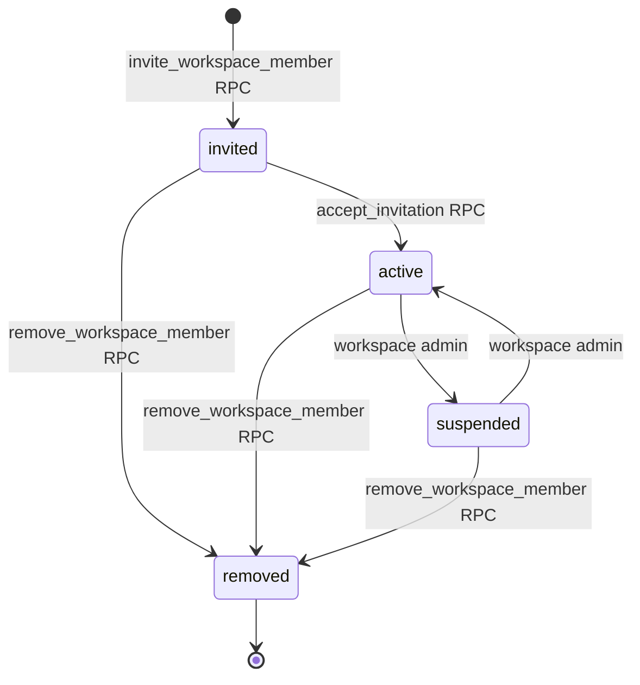

| From → To | Trigger / RPC | Capability | Precondition | Side effect | Atomic | Event |
|---|---|---|---|---|---|---|
| ∅ → `invited` | `invite_workspace_member` | `workspace.manage_members` | Target email not already an active member | Inserts `invitations` row | Yes | `workspace.member.invited` |
| `invited` → `active` | `accept_invitation` | Caller `auth.email()` matches invitation | Valid unexpired token | Invitation → `accepted` | Yes | `workspace.member.activated` |
| `active` → `suspended` | direct or RPC | `workspace.manage_members` | Not sole owner if owner | — | Yes | `workspace.member.suspended` |
| `suspended` → `active` | direct or RPC | `workspace.manage_members` | — | — | Yes | `workspace.member.activated` |
| any → `removed` | `remove_workspace_member` | `workspace.manage_members` | Not sole active owner | Roster rows retained for history | Yes | `workspace.member.removed` |

**Role changes** are not state transitions. Handled by `change_workspace_member_role` RPC, emitting `workspace.member.role_changed`. Cannot demote sole owner. Cannot change `user_id` (trigger-enforced).

Terminal: **`removed`** (soft).

---

## 4. Stakeholder (`stakeholders`)

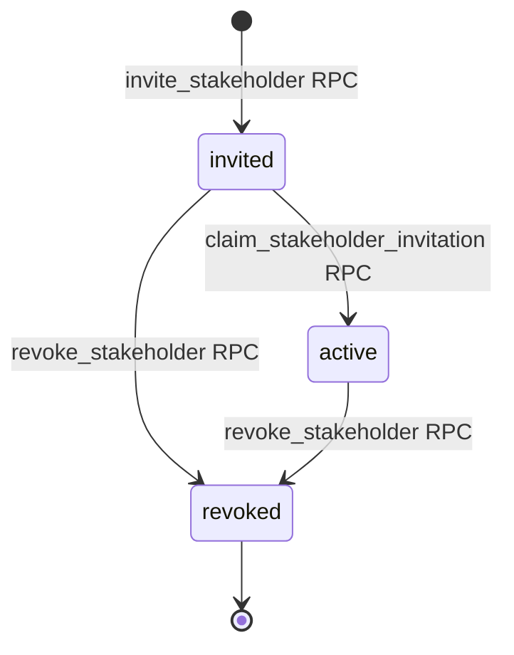

| From → To | Trigger / RPC | Capability | Precondition | Side effect | Atomic | Event |
|---|---|---|---|---|---|---|
| ∅ → `invited` | `invite_stakeholder` | `workspace.manage_stakeholders` | Email not already an active stakeholder of the workspace | Inserts `invitations` + `stakeholders` (user_id NULL) atomically | Yes | `stakeholder.invited` |
| `invited` → `active` | `claim_stakeholder_invitation` | `auth.email()` matches invitation email | Valid unexpired token; token bound to this stakeholder record | `stakeholders.user_id = auth.uid()`; may activate related `project_participants`; invitation → `accepted` | Yes | `stakeholder.claimed` |
| any → `revoked` | `revoke_stakeholder` | `workspace.manage_stakeholders` | — | Related `project_participants` set to `removed` | Yes | `stakeholder.revoked` |

**Invitation-scoped claim** — one stakeholder record per invitation. No silent cross-workspace binding.

Terminal: **`revoked`** (soft).

---

## 5. Invitation (`invitations`)

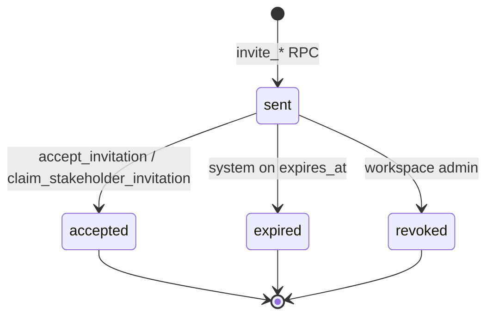

| From → To | Trigger / RPC | Capability | Precondition | Side effect | Atomic | Event |
|---|---|---|---|---|---|---|
| ∅ → `sent` | `invite_workspace_member` / `invite_stakeholder` | as above | — | Token hash stored | Yes | (rolled into member/stakeholder invited event) |
| `sent` → `accepted` | `accept_invitation` / `claim_stakeholder_invitation` | caller-email match | Not expired, not revoked | Creates or activates target row | Yes | (rolled into activated/claimed event) |
| `sent` → `expired` | scheduled job | system | `now() > expires_at` | — | Yes | `invitation.expired` |
| `sent` → `revoked` | RPC | `workspace.manage_members` / `workspace.manage_stakeholders` | — | — | Yes | `invitation.revoked` |

Terminal: **`accepted`**, **`expired`**, **`revoked`**.

---

## 6. Project (`projects`)

**MVP lifecycle: `active → archived` (with unarchive).**

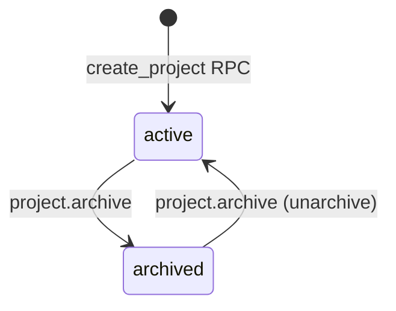

| From → To | Trigger | Capability | Precondition | Side effect | Atomic | Event |
|---|---|---|---|---|---|---|
| ∅ → `active` | `create_project` | `project.create` (workspace-scoped) | Slug unique in workspace | Creates first `project_participants` (creator as `lead`) | Yes | `project.created` |
| `active` → `archived` | direct or RPC | `project.archive` | — | Project content becomes read-only in UI; DB does not lock structurally in MVP | No | `project.archived` |
| `archived` → `active` | direct | `project.archive` | — | — | No | `project.unarchived` |

**Reserved (future — not implemented in MVP):**
- Schema `status` enum retains `draft`, `on_hold`, `closed`. No transitions to/from these in MVP; no events emitted for them.
- Corresponding events (`project.activated`, `project.on_hold`, `project.resumed`, `project.closed`) are classified P1/P2 in `EVENT_MODEL.md`.

Hard delete of a project row is an admin-only operation, allowed only when no `asset_versions` past `draft` exist. Not a state transition.

---

## 7. Design Asset (`design_assets`)

**MVP lifecycle: `active → archived` (with unarchive).**

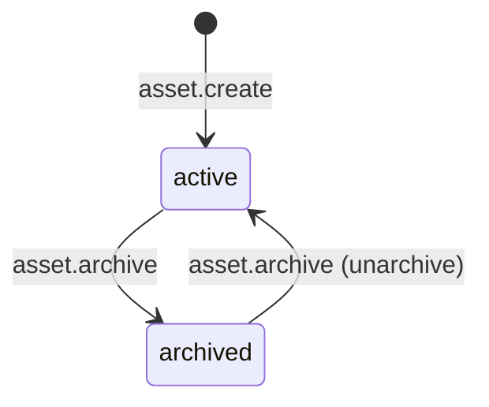

| From → To | Trigger | Capability | Precondition | Side effect | Atomic | Event |
|---|---|---|---|---|---|---|
| ∅ → `active` | direct | `asset.create` | — | — | No | `asset.created` |
| `active` → `archived` | direct | `asset.archive` | — | **`current_version_id` is preserved** (domain invariant) | No | `asset.archived` |
| `archived` → `active` | direct | `asset.archive` | — | — | No | `asset.unarchived` |

**Reserved (future — not implemented in MVP):**
- Schema `status` enum retains `draft`, `deprecated`. No transitions to/from these in MVP; no events emitted.
- `asset.deprecated` and `asset.reactivated` events are classified P1/P2. **Design iteration is handled through Versions**, not through asset-level deprecation, in MVP.
- No terminal state in MVP. Archived is soft.

### 7.1 `design_assets.current_version_id`

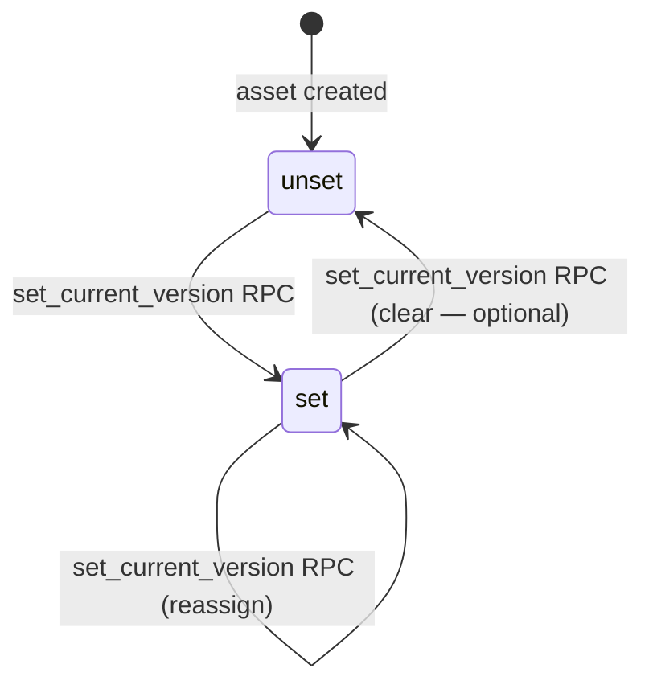

| Trigger | RPC | Capability | Precondition | Side effect | Atomic | Event |
|---|---|---|---|---|---|---|
| set / reassign | `set_current_version` | `asset.set_current` | Target version belongs to this asset (composite FK); target is `published` (application check) | Prior current retained in `activity_events` payload | Yes | `asset.current_version_changed` |

**Not automatic under any other transition.** `version.publish`, `approval.approved`, and `release.finalized` all leave `current_version_id` untouched.

---

## 8. Asset Version (`asset_versions`)

The most consequential state machine in LIGN. Immutability is trigger-enforced.

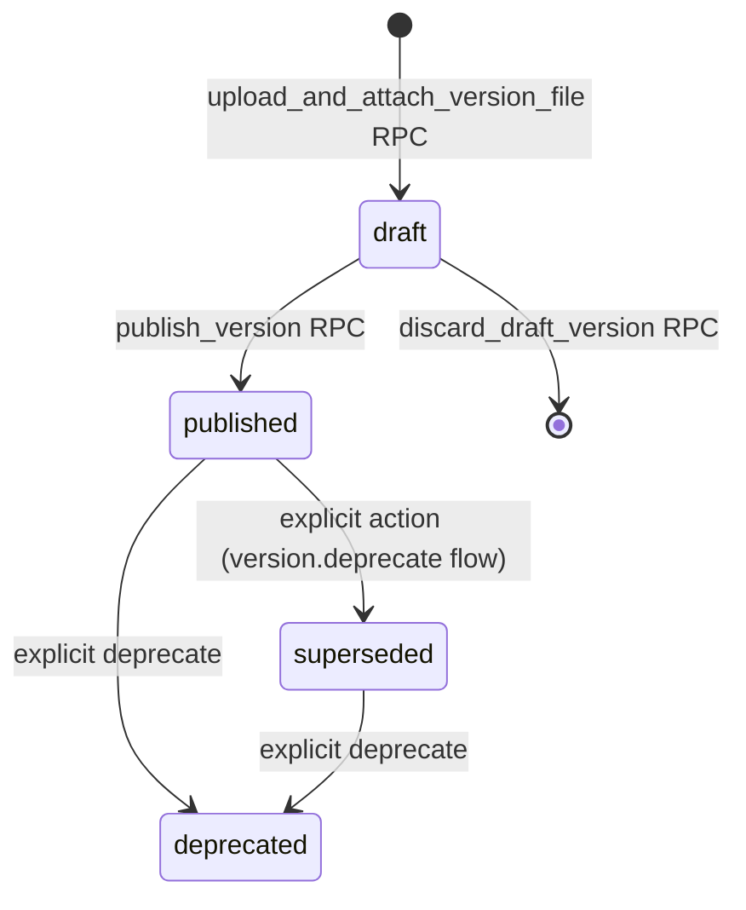

| From → To | Trigger / RPC | Capability | Precondition | Side effect | Atomic | Event |
|---|---|---|---|---|---|---|
| ∅ → `draft` | `upload_and_attach_version_file` | `version.upload` | `sequence = MAX(sequence) + 1` for asset; workspace scope matches | May create `files` row + `version_files` row(s) in same transaction | Yes | `version.uploaded` |
| `draft` → `published` | `publish_version` | `version.publish` | At least one `version_files` attached | Sets `published_at`, `published_by_profile_id`; `version_files` becomes immutable; **`current_version_id` is not changed; prior `published` versions are not automatically superseded**; no approval or release side-effect | Yes | `version.published` |
| `draft` → ∅ | `discard_draft_version` | `version.discard_draft` | No downstream refs (FK RESTRICT enforces) | Deletes `version_files` then `asset_versions` | Yes | `version.draft_discarded` |
| `published` → `superseded` | explicit RPC / capability | `asset.edit` (project lead/contributor) | Superseding version chosen by user, if any | Sets `superseded` on target; historical content unchanged | Yes | `version.superseded` |
| `published` / `superseded` → `deprecated` | explicit RPC / capability | `asset.edit` | — | Sets `deprecated_at`, `deprecation_note` | Yes | `version.deprecated` |

### 8.1 Publish semantics (MVP)

Publishing v(N) of asset A:
- Sets v(N).status = `published`.
- **Does not** change any other `asset_versions` row on the same asset. **Multiple `published` versions may coexist** — Latest, Current, Published, Approved, and Released remain independent.
- Emits `version.published`.

If a user wants to mark a prior version as `superseded` or `deprecated`, that is a **separate, explicit action** with its own capability check and event. No supersession is inferred from publish.

### 8.2 Version-lifecycle invariants (schema-level, reiterated)
- `UNIQUE (design_asset_id, sequence)` enforces version ordering.
- Sequence assigned at `draft` creation.
- `published` content is immutable (trigger).
- No hard delete after `published`.

**No formal terminal state** — `published`, `superseded`, `deprecated` all preserve history; only `draft` may be hard-deleted.

---

## 9. Review (`reviews`)

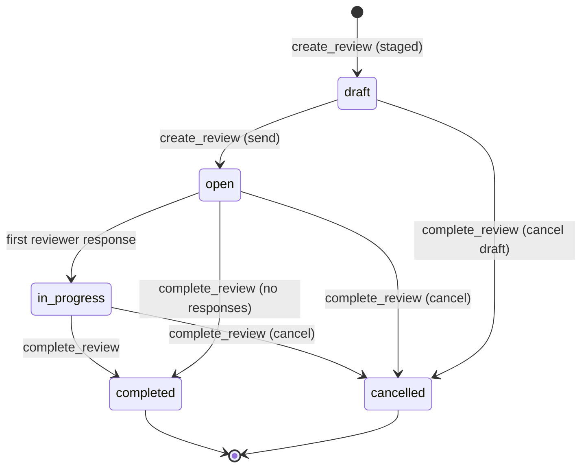

| From → To | Trigger / RPC | Capability | Precondition | Side effect | Atomic | Event |
|---|---|---|---|---|---|---|
| ∅ → `draft` | `create_review` | `review.create` | Target `version_id` is `published`; version belongs to review's asset | Reviewer slots may be created in same call | Yes | `review.created` |
| `draft` → `open` | RPC (may be single-step create) | `review.create` | At least one `review_participants` row | Slots actionable; notifications fire | Yes | `review.opened` |
| `open` → `in_progress` | first reviewer response | system | Reviewer submits response via `review.participate` | Auto-transition inside response RPC | Yes | (captured by `review.reviewer_responded`) |
| any pre-terminal → `completed` | `complete_review` | `review.complete` | — | Comments targeting this review become immutable (`comment.edit_own` denied per PERMISSIONS.md §8 Group G) | Yes | `review.completed` |
| any pre-terminal → `cancelled` | `complete_review` | `review.complete` | — | Same immutability | Yes | `review.cancelled` |

Terminal: **`completed`**, **`cancelled`**.

**Reviewer-slot micro-state** (`review_participants.status`): `pending → commented | signed_off | declined`. Reviewer transitions via `review.participate`. `signed_off` and `declined` are terminal for the slot.

---

## 10. Comment (`comments`)

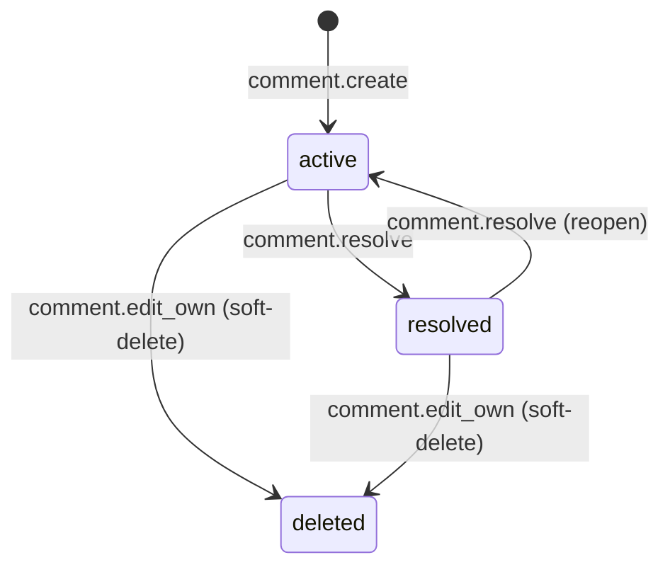

| From → To | Trigger | Capability | Precondition | Side effect | Atomic | Event |
|---|---|---|---|---|---|---|
| ∅ → `active` | direct | `comment.create` | `author_profile_id = auth.uid()` | May emit `comment.mentioned` per mentioned participant | Yes | `comment.created` |
| `active` ↔ `resolved` | direct | `comment.resolve` | — | Sets/clears `resolved_at` | Yes | `comment.resolved` / `comment.reopened` |
| any → `deleted` (soft) | direct | `comment.edit_own` (own row) | Own comment | Sets `deleted_at`; thread structure preserved | Yes | `comment.deleted` |

**Reopen is allowed** (per approved decision D4).

**Edit** is not a state transition — it mutates `body` and inserts a `comment_edits` row, emitting `comment.edited`. Rejected if the containing/contextualizing Review is `completed` or `cancelled` (PERMISSIONS.md §8 Group G).

**Mentions** — `comment.create` and `comment.edit_own` parse simple `@person` mentions from `body` and emit one `comment.mentioned` event per mentioned project participant. Mentions must resolve to profiles who are active `project_participants` of the comment's project; unrecognized mentions produce no event.

No terminal state.

---

## 11. Annotation (`annotations`)

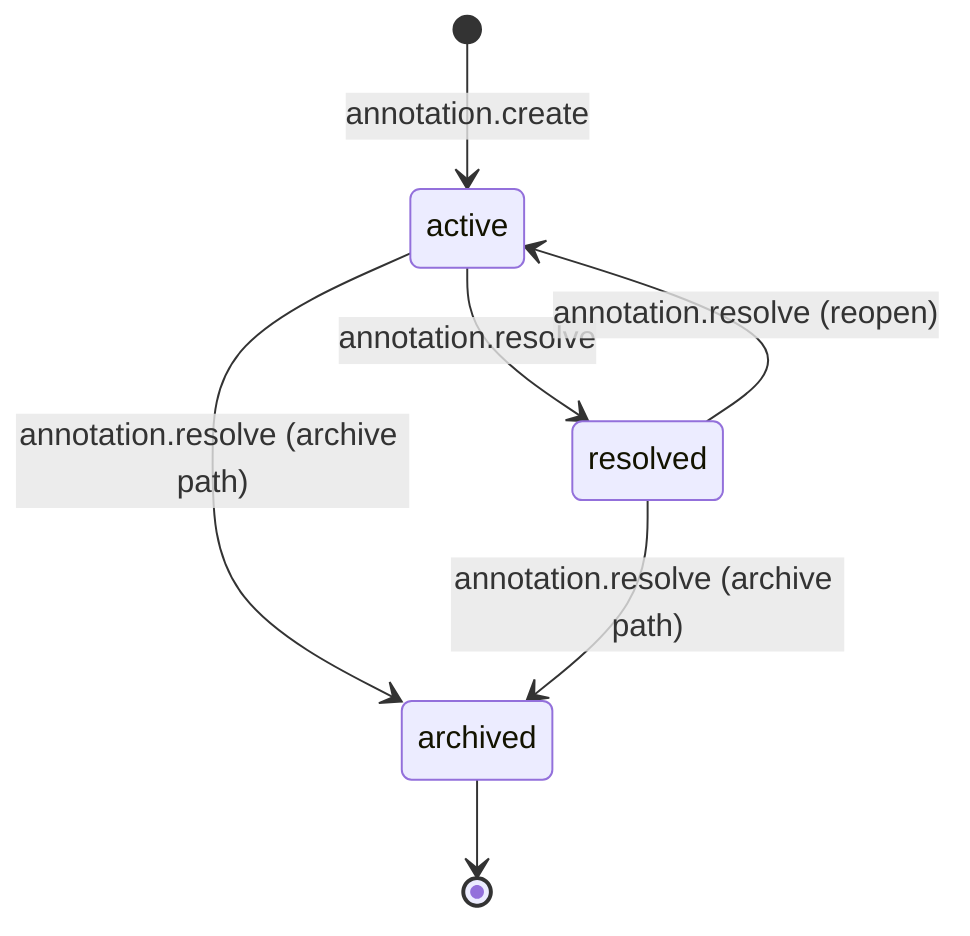

| From → To | Trigger | Capability | Precondition | Side effect | Atomic | Event |
|---|---|---|---|---|---|---|
| ∅ → `active` | direct | `annotation.create` | `author_profile_id = auth.uid()`; `position`, `anchor_kind` immutable after insert | — | Yes | `annotation.created` |
| `active` ↔ `resolved` | direct | `annotation.resolve` | — | — | Yes | `annotation.resolved` / (reopen — see note) |
| any → `archived` | direct | `annotation.resolve` | — | **Terminal** (per approved decision D5) | Yes | `annotation.archived` |

Terminal: **`archived`**. Annotation is permanently anchored to its origin version.

`annotation.reopened` (unresolve) is possible via toggle but is deferred as P1 in `EVENT_MODEL.md` (feed-only, low audit value).

---

## 12. Change (`changes`)

**MVP lifecycle: `proposed → accepted | rejected | withdrawn`.**

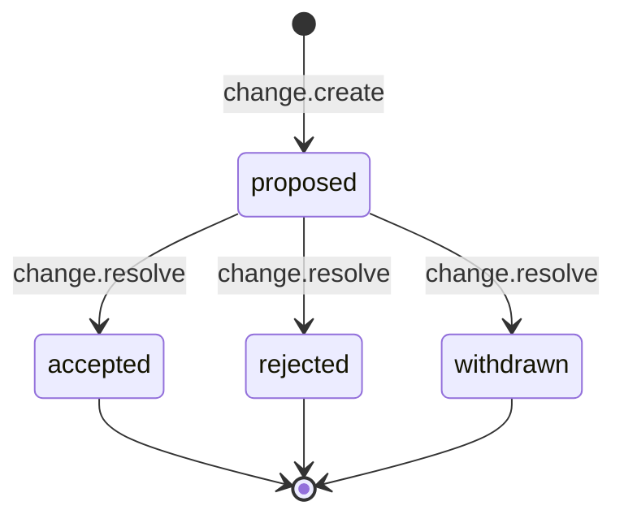

| From → To | Trigger | Capability | Precondition | Side effect | Atomic | Event |
|---|---|---|---|---|---|---|
| ∅ → `proposed` | direct | `change.create` | `author_profile_id = auth.uid()` | — | Yes | `change.created` |
| `proposed` → `accepted` | direct | `change.resolve` | — | Sets `resolved_at`. **`to_version_id` may be set here or later** to link the implementing Version, without a further state transition. | Yes | `change.accepted` |
| `proposed` → `rejected` | direct | `change.resolve` | — | Sets `resolved_at` | Yes | `change.rejected` |
| `proposed` → `withdrawn` | direct | `change.resolve` | — | — | Yes | `change.withdrawn` |

Terminal: **`accepted`**, **`rejected`**, **`withdrawn`**. Description mutable only while `proposed`.

**Accepted changes may remain accepted indefinitely** (per approved decision D6). Linking a `to_version_id` when an implementing version publishes is a metadata update on the accepted row, not a state transition.

**Reserved (future — not implemented in MVP):**
- Schema `status` enum retains `under_review` and `implemented`. No transitions to these in MVP; no events emitted.
- `change.under_review` and `change.implemented` events are classified P1/P2 in `EVENT_MODEL.md`.

---

## 13. Approval Request (`approval_requests`)

**MVP: request creation places the request directly into `in_progress`.** The `pending` schema value is reserved for a future draft-then-send flow but is not exercised by MVP transitions.

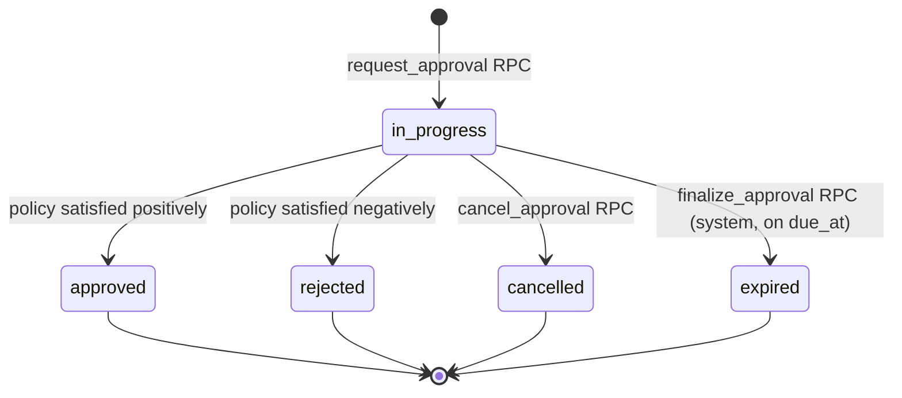

| From → To | Trigger / RPC | Capability | Precondition | Side effect | Atomic | Event |
|---|---|---|---|---|---|---|
| ∅ → `in_progress` | `request_approval` | `approval.request` | **DB-boundary**: target `version_id` must be `published`; approver set non-empty; no other active request for same (asset, version) | Creates `approval_requests` (status = `in_progress`) + `approval_request_approvers` slots atomically. Approver set frozen from the outset. | Yes | `approval.requested` |
| `in_progress` → `approved` | evaluated inside `respond_to_approval` or `finalize_approval` | system (inside RPC) | Policy `any`: any response is `approved`. Policy `all`: every slot has response `approved` | Sets `outcome_at`, `outcome_actor_profile_id`, `outcome_note` | Yes (under `SELECT … FOR UPDATE` on request) | `approval.approved` |
| `in_progress` → `rejected` | evaluated inside `respond_to_approval` | system (inside RPC) | Policy `any`: all slots have non-approved responses. Policy `all`: any response is `rejected` or `changes_requested` | Sets outcome fields | Yes | `approval.rejected` |
| `in_progress` → `cancelled` | `cancel_approval` | `approval.cancel` | — | Sets outcome fields | Yes | `approval.cancelled` |
| `in_progress` → `expired` | `finalize_approval` (scheduler) | system | `now() > due_at` and not yet terminal | Sets outcome fields; `outcome_actor_profile_id = NULL` | Yes | `approval.expired` |

Terminal: **`approved`**, **`rejected`**, **`cancelled`**, **`expired`**. All immutable.

**Reserved (future — not implemented in MVP):**
- Schema `status` enum retains `pending`. Not entered by any MVP transition. A future draft-then-send UX may create in `pending` and later transition to `in_progress`.

**Approval does not change `design_assets.current_version_id`.**

---

## 14. Approval Response (`approval_responses`)

Micro-machine on the (slot, response) pair:

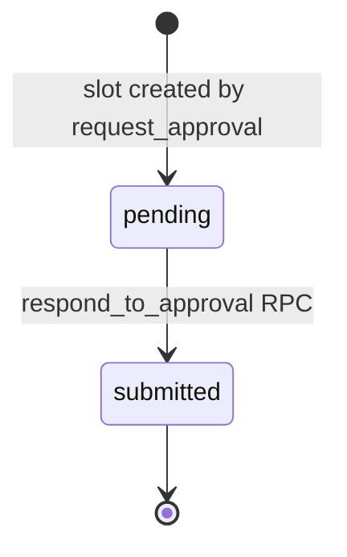

| From → To | Trigger / RPC | Capability | Precondition | Side effect | Atomic | Event |
|---|---|---|---|---|---|---|
| slot created → `pending` | inside `request_approval` | — | — | — | Yes | (part of `approval.requested`) |
| `pending` → `submitted` | `respond_to_approval` | `approval.respond` | Caller's `auth.uid()` matches the slot's underlying profile; parent request in `in_progress` | Response is immutable; parent request lock-evaluated for terminal condition | Yes (under lock on `approval_requests`) | `approval.responded` (with `decision`) |

Response immutable after submission. Trigger-enforced.

`decision` values: `approved | rejected | changes_requested`. No `abstain`.

---

## 15. Release (`releases`)

**MVP lifecycle: `draft → released → withdrawn`.** No `scheduled` state in MVP.

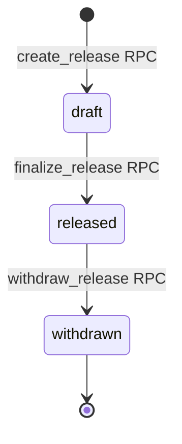

| From → To | Trigger / RPC | Capability | Precondition | Side effect | Atomic | Event |
|---|---|---|---|---|---|---|
| ∅ → `draft` | `create_release` | `release.create` | Project exists in same workspace | — | Yes | `release.created` |
| `draft` ↔ item mutations | `add_release_item` / `remove_release_item` | `release.create` | Item's version belongs to release's project (composite FK); parent still `draft` | Version must have positive `approval_requests` outcome (application check at add time; reasserted at finalize) | Yes | `release.item_added` / `release.item_removed` |
| `draft` → `released` | `finalize_release` | `release.finalize` | **DB-boundary**: every `release_items` row's version has a completed `approval_requests` with `status='approved'` | Sets `released_at`; items become immutable; `current_version_id` unchanged | Yes (under lock on release row) | `release.finalized` |
| `released` → `withdrawn` | `withdraw_release` | `release.withdraw` | Reason provided | Sets `withdrawn_at`, `withdrawn_reason` | Yes | `release.withdrawn` |

Terminal: **`withdrawn`**. `released` is effectively terminal but may transition to `withdrawn`.

**Reserved (future — not implemented in MVP):**
- Schema `status` enum retains `scheduled` and `superseded`. Not entered by any MVP transition.
- **Releases do not automatically supersede prior releases** in MVP. A prior release remains `released` when a new one is finalized. A future workflow may transition prior releases to `superseded`; this is not built in MVP.
- Related events (`release.scheduled`, `release.superseded`) are classified P1/P2.

**Release does not change `design_assets.current_version_id`.**

---

## 15a. Requirement (`requirements`) — added by REQUIREMENTS 002/003

**States:** `draft`, `active`, `superseded`, `archived`.

Structural invariants (enforced by REQUIREMENTS 002 triggers/CHECKs):
- Hierarchy depth = 1: a sub-requirement's parent must itself be a root.
- `code`, `workspace_id`, `project_id`, `parent_requirement_id` are **immutable** after INSERT.
- `status='superseded'` ⇔ `superseded_by_requirement_id IS NOT NULL` (superseded-coherence CHECK).
- `status='archived'` ⇔ `archived_at IS NOT NULL` (archived-coherence CHECK).
- Cannot supersede a requirement with itself.

| Transition | RPC | Capability | Preconditions | On success | Emitted event |
|---|---|---|---|---|---|
| ∅ → `draft` \| `active` | `create_requirement` | `requirement.create` | Title non-blank; initial status ∈ {draft, active}; parent (if any) in same project and a root | Server-generates code (`R-NNN` root or `<parent>.<n>` sub) under per-project advisory xact lock | `requirement.created` |
| `draft` ↔ `active` (or field edits) | `edit_requirement` | `requirement.edit` | Row not superseded/archived; no attempt to change code/workspace/project/parent; status if supplied ∈ {draft, active} | Fields updated; no-op edits return `out_updated=false` and emit nothing | `requirement.updated` (`kind='edit'`) iff any field changed |
| `draft` \| `active` → `archived` | `archive_requirement` | `requirement.archive` | Row not superseded | Sets `archived_at`; idempotent for already-archived (returns false, no event) | `requirement.archived` on new transition |
| `draft` \| `active` → `superseded` | `supersede_requirement(old, new)` | `requirement.edit` | Both rows same project; replacement ∈ {draft, active}; not self-supersede | Sets `superseded_by_requirement_id` on old row; new row unchanged | `requirement.updated` (`kind='supersede'`) on old row |
| Applicability change | `set_requirement_applicability` | `requirement.edit` | Row not sub-requirement (inherits from parent); not superseded/archived; each asset in same project | Replaces the join set; empty array = project-wide | `requirement.updated` (`kind='applicability'`) iff added+removed > 0 |

Terminal states: `superseded`, `archived`. No un-archive, no un-supersede in MVP — audit stability. Applicability rows and prior assessments are preserved as historical records when a requirement is superseded or archived.

**Sub-requirements** inherit their parent's applicability (enforced in `set_requirement_applicability` and in the assessment applicability trigger). A sub-requirement cannot have its own `requirement_design_assets` rows.

---

## 15b. Version Requirement Assessment (`version_requirement_assessments`) — added by REQUIREMENTS 002/003

**States:** implicit `not_assessed` (row absent), then `satisfied` / `partial` / `not_satisfied` / `not_applicable` (row present).

Structural invariants:
- Unique per `(asset_version_id, requirement_id)`.
- `workspace_id`, `project_id`, `asset_version_id`, `requirement_id` are immutable after INSERT.
- Version and requirement must be in the same workspace + project (composite FKs).
- The requirement must be applicable to the version's design_asset (BEFORE-INSERT/UPDATE trigger `vra_enforce_applicability`, with parent-applicability inheritance for sub-requirements).

| Transition | RPC | Capability | Preconditions | On success | Emitted event |
|---|---|---|---|---|---|
| ∅ → `satisfied` \| `partial` \| `not_satisfied` \| `not_applicable` | `assess_version_requirement` (INSERT path) | `requirement.assess` | Version + requirement in same project; requirement not archived; status ∈ enum | Inserts assessment; `assessed_by_profile_id=auth.uid()`, `assessed_at=now()` | `requirement.assessed` with `action='created'` |
| existing → new status | `assess_version_requirement` (UPDATE path) | `requirement.assess` | Same preconditions | Upserts on `(version, requirement)` UNIQUE; overwrites status/note/assessor/assessed_at | `requirement.assessed` with `action='updated'` and `previous_status` |

Terminal: none — assessments are mutable via the same upsert RPC. Never deleted (append-only in spirit). Historical UPDATEs are captured through the emitted `requirement.assessed` events and the `subject_snapshot.previous_status` field.

**Interaction with version publish:** publishing a new version does NOT carry assessments forward from the previous version. The frontend may offer a "carry-forward" action, which creates fresh assessment rows attributed to the person who clicked it (explicit human moment, deliberate design choice).

---

## 16. Non-goals

Explicitly out of scope:
- No workflow builder, no configurable transitions, no custom state machines.
- No sub-state machines for `Decision`, `File`, `Collection`, `Workspace`, `Profile`. Trivial or single-transition lifecycles.
- No orchestration engine. RPCs run linearly under Postgres transactions.
- No event sourcing. `activity_events` is a history log, not a reduction spine.
- No automatic supersession of any kind (versions, releases). Supersession is always an explicit action.

---

## 17. RPC operations required by state machines

Consolidated from §§3–15. Each corresponds to at least one MVP transition.

**Identity & access**
- `create_workspace`, `invite_workspace_member`, `accept_invitation`, `change_workspace_member_role`, `remove_workspace_member`
- `invite_stakeholder`, `claim_stakeholder_invitation`, `revoke_stakeholder`
- (system) `expire_invitation`

**Projects & participation**
- `create_project`
- `add_project_participant`, `change_project_participant_role`, `remove_project_participant`

**Versions**
- `upload_and_attach_version_file`
- `publish_version`
- `discard_draft_version`
- `supersede_version` and `deprecate_version` (explicit, on-demand; MVP surfaces may or may not expose in UI)

**Assets**
- `set_current_version`

**Reviews**
- `create_review` (may open in same call)
- `reviewer_respond` (via `review.participate`)
- `complete_review` / `cancel_review`

**Approvals**
- `request_approval` (creates directly in `in_progress`; enforces target-eligibility DB-boundary invariant)
- `respond_to_approval` (evaluates terminal condition atomically)
- `cancel_approval`
- `finalize_approval` (scheduled, for expiry)

**Releases**
- `create_release`, `add_release_item`, `remove_release_item`
- `finalize_release` (enforces release-approval DB-boundary invariant)
- `withdraw_release`

**Comments**
- `edit_own_comment` (writes `comment_edits`; checks review-completion gate; parses/emits mentions)

---

## 18. Resolved decisions (from prior review)

All prior open decisions have been resolved by the approved product decisions:

| # | Question | Resolution |
|---|---|---|
| D1 | Auto-supersede on publish? | **No.** Publishing does not supersede. Multiple `published` versions may coexist. Supersession is explicit. |
| D2 | `pending → in_progress` as separate step? | **Collapsed.** `request_approval` creates directly in `in_progress`. `pending` is reserved schema value only. |
| D3 | Release `scheduled` intermediate? | **Removed from MVP.** Reserved schema value only. |
| D4 | Comment resolve toggle? | **Yes, reopen allowed.** |
| D5 | Annotation `archived` terminal? | **Yes.** |
| D6 | Accepted change stays accepted? | **Yes**, indefinitely. Linking `to_version_id` is metadata, not a transition. |
| D7 | Auto-supersede releases? | **No.** Releases do not automatically supersede prior releases. |

MVP simplifications applied to Project, Design Asset, Change, Approval Request, and Release lifecycles (§§6, 7, 12, 13, 15). Schema enum values reserved for future workflows remain untouched — no changes to `DATABASE_SCHEMA.md`.
